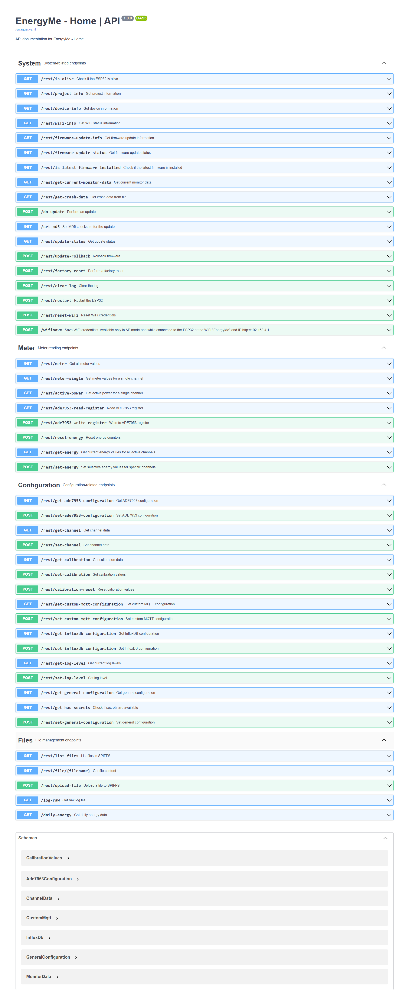

# EnergyMe-Home

EnergyMe-Home is an open-source energy monitoring system designed for home use, capable of monitoring up to 17 circuits and integratable with any platform thanks to its Restful API, MQTT, and Modbus TCP support. Moreover, a cloud platform is available for free to store and visualize your data.

## Introduction

Welcome to ***EnergyMe-Home***, fellow energy-enthusiast! This project is all about making energy monitoring easy, affordable, and accessible for everyone. As a maker, I wanted to create a fully open-source energy meter that anyone can build and customize. *EnergyMe-Home* can **monitor up to 17 circuits at once**, giving you detailed insights into your home's energy consumption.

By combining hardware and software, this project empowers you to take control of your energy usage and simultaneously save on costs. Whether you're a DIY enthusiast, an energy-conscious homeowner, or just curious about IoT and energy monitoring, EnergyMe-Home is here to help you get started.

## Hardware

The hardware (currently at **v5**) consists of both the PCB design and the components used to build the energy monitoring system.

The key components include:

- ESP32-S3: the brain of the project
- ADE7953: single-phase energy measurement IC
- Multiplexers: used to monitor multiple circuits at once
- 3.5 mm jack connectors: used to easily connect current transformers

PCB schematics and BOMs are available in the `documentation/Schematics` directory, while datasheets for key components are in the `documentation/Components` directory. Additional hardware specifications and technical details can be found in the [`documentation/README.md`](documentation/README.md).

The project is published on *EasyEDA* for easy access to the PCB design files. You can find the project on [EasyEDA OSHWLab](https://oshwlab.com/jabrillo/multiple-channel-energy-meter).

## Software

The software is written in C++ using the *PlatformIO* ecosystem and *Arduino framework*. All source code is available in the [`source`](source) directory with build instructions provided by PlatformIO.

The main features of the software include:

- **ADE7953** class for configuring and reading data from the IC
- **Comprehensive Authentication System** with token-based security, HTTP-only cookies, password hashing, session management, and protected endpoints
- **Crash reporting** system leveraging the RTC memory of the ESP32 for enhanced debugging and stability
- **Custom MQTT** for publishing data to an MQTT broker
- **InfluxDB Integration** for seamless time-series data storage with support for both v1.x and v2.x, SSL/TLS, buffering, and automatic retry logic
- **Web server** for real-time monitoring, historical data, firmware updates (with MD5 integrity check), and system configuration
- **Captive Wi-Fi portal** for easy initial Wi-Fi configuration
- **LED control** for visual status indication
- **Modbus TCP server** for serving data to Modbus clients
- **MQTT** support for cloud services and remote monitoring
- **Multiplexer** for reading multiple circuits at once
- **mDNS Support** for local network discovery
- **Enhanced Stability Features** including crash monitoring, memory management, watchdog timers, and automatic firmware rollback
- **Logging** system with multiple levels and web interface access
- **Secure Firmware Updates** with MD5 hash verification
- **Secrets Management** for secure credential handling
- **Local Data Storage** with JSON configuration files
- **Detailed Calibration Process** for measurement accuracy

Implementation details are documented in the source code headers and comments. Key components have dedicated header files with comprehensive documentation.

## Integration

### Restful API

All the data collected by the energy monitoring system, as well as the configuration settings, can be accessed through the Restful API.

A complete swagger documentation of the Restful API is available in the [`swagger.yaml`](source/resources/swagger.yaml) file.

### MQTT

The energy monitoring system can also publish data to an MQTT broker (unprotected and protected with username and password). Implementation details are documented in [`source/include/custommqtt.h`](source/include/custommqtt.h).

### Modbus TCP

The energy monitoring system can also act as a Modbus TCP server, exposing many registers for reading the data (single channel and aggregated data). Implementation details are documented in [`source/include/modbustcp.h`](source/include/modbustcp.h).

### InfluxDB Integration

EnergyMe-Home now includes native InfluxDB integration for seamless time-series data storage and visualization. The system supports both InfluxDB v1.x and v2.x with the following features:

- **Universal InfluxDB Support**: Compatible with both InfluxDB v1.x (username/password) and v2.x (token-based authentication)
- **SSL/TLS Security**: Secure connections with configurable SSL certificate validation
- **Intelligent Buffering**: Local data buffering with configurable batch sizes and automatic retry logic
- **Connection Management**: Automatic reconnection with exponential backoff for enhanced reliability
- **Flexible Configuration**: Configurable measurement names, field mapping, and write frequency
- **Real-time Monitoring**: Web interface shows connection status and write statistics
- **RESTful API**: Complete API endpoints for InfluxDB configuration and management

The InfluxDB client automatically formats energy data using the line protocol and handles both real-time measurements and energy accumulations. Configuration is available through the web interface with real-time status monitoring and connection testing. Implementation details are documented in [`source/include/influxdbclient.h`](source/include/influxdbclient.h).

## Security & Authentication

EnergyMe-Home features a comprehensive authentication system to secure access to the web interface and protect critical system operations. The system provides enterprise-grade security while maintaining ease of use.

### Key Security Features

- **Token-Based Authentication**: Secure session management with automatic expiration
- **Password Protection**: Strong password hashing and secure credential storage
- **Protected Operations**: All critical system functions require authentication
- **Session Security**: HTTP-only cookies and automatic session renewal
- **Vulnerability Protection**: Built-in protection against common web security threats

### Default Credentials

- **Username**: `admin`
- **Password**: `admin123`

**Important**: Change the default credentials immediately after first login for security.

### Getting Started

1. Navigate to your device's IP address
2. Use the default credentials to log in
3. Change the default password when prompted
4. Access all system features through the authenticated web interface

The authentication system is fully integrated with the REST API and supports secure session management across all device features. For detailed technical implementation information, see the [source code documentation](source/README.md#security--authentication).

### Home Assistant Integration

EnergyMe-Home integrates with Home Assistant through a dedicated custom integration for convenient energy monitoring directly in your dashboard.

- **Simple Setup**: Only requires the device IP address (automatic discovery via mDNS coming soon)
- **Real-time Data**: All energy measurements and system information as Home Assistant entities
- **Complete Access**: Monitor all circuits and aggregate data within Home Assistant

Get started at [homeassistant-energyme](https://github.com/jibrilsharafi/homeassistant-energyme).

## Contributing

Contributions are welcome! Please read the [contributing guidelines](CONTRIBUTING.md) for more information.

## License

This project is licensed under the terms of the GNU General Public License v3.0. See the [LICENSE](LICENSE) file for details.
