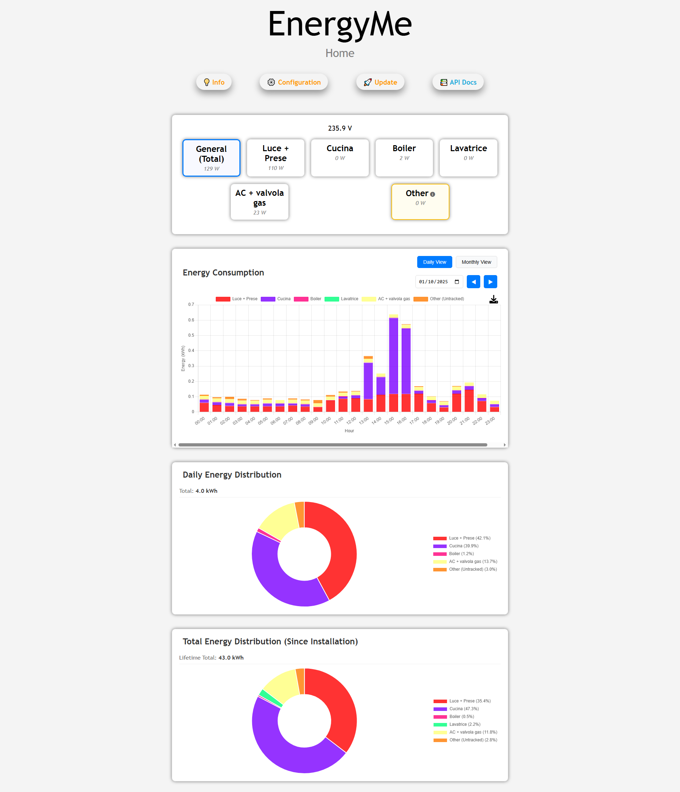

# EnergyMe-Home

EnergyMe-Home is an open-source energy monitoring system designed for home use, capable of monitoring up to 17 circuits and integratable with any platform thanks to its Restful API, MQTT, and Modbus TCP support. Moreover, a cloud platform is available for free to store and visualize your data.

## Introduction

Welcome to ***EnergyMe-Home***, fellow energy-enthusiast! This project is all about making energy monitoring easy, affordable, and accessible for everyone. As a maker, I wanted to create a fully open-source energy meter that anyone can build and customize. *EnergyMe-Home* can **monitor up to 17 circuits at once**, giving you detailed insights into your home's energy consumption.

By combining hardware and software, this project empowers you to take control of your energy usage and simultaneously save on costs. Whether you're a DIY enthusiast, an energy-conscious homeowner, or just curious about IoT and energy monitoring, EnergyMe-Home is here to help you get started.

## Hardware

The hardware (currently at **v5**) consists of both the PCB design and the components used to build the energy monitoring system.

The key components include:

- ESP32-S3: the brain of the project
- ADE7953: single-phase energy measurement IC
- Multiplexers: used to monitor multiple circuits at once
- 3.5 mm jack connectors: used to easily connect current transformers

Detailed PCB schematics and BOMs are available in the `documentation/Schematics` directory, while datasheets for the key components are available in the `documentation/Components` directory.

## Software

The software is written in C++ and uses the *PlatformIO* ecosystem and the *Arduino framework* for development. All the code is available in the [`source`](source) directory.

The main features of the software include:

- **ADE7953** class for configuring and reading data from the IC
- **Crash reporting** system leveraging the RTC memory of the ESP32 for enhanced debugging and stability. (More details in `source/README.md`)
- **Custom MQTT** for publishing data to an MQTT broker
- **Web server** for real-time monitoring, historical data, updating firmware (with MD5 integrity check), and configuring the system
- **Captive Wi-Fi portal** for easy initial Wi-Fi configuration
- **LED control** for visual status indication
- **Modbus TCP server** for serving data to Modbus clients
- **MQTT** support for cloud services and remote monitoring
- **Multiplexer** for reading multiple circuits at once
- **mDNS Support** for local network discovery
- **Logging** system with multiple levels (INFO, WARNING, ERROR, FATAL, DEBUG) and the ability to view/download logs via the web interface.
- **Secure Firmware Updates:** Firmware updates are handled via the web interface and include MD5 hash checking to ensure integrity.
- **Secrets Management:** Secure handling of credentials for AWS IoT and local data encryption. (More details in `source/README.md`)
- **Data Storage:** Configuration and energy data are stored locally in JSON files. (More details in `source/README.md`)
- **Detailed Calibration Process:** The system allows for calibration of measurements for accuracy. (More details in `source/README.md`)

## Integration

### Restful API

All the data collected by the energy monitoring system, as well as the configuration settings, can be accessed through the Restful API.

A full swagger documentation of the Restful API is available in the [`swagger.yaml`](source/resources/swagger.yaml).

### MQTT

The energy monitoring system can also publish data to an MQTT broker (unprotected and protected with username and password). More info at [`source/include/custommqtt.h`](source/include/custommqtt.h).

### Modbus TCP

The energy monitoring system can also act as a Modbus TCP server, exposing many registers for reading the data (single channel and aggregated data). More info at [`source/include/modbustcp.h`](source/include/modbustcp.h).

## Contributing

Contributions are welcome! Please read the [contributing guidelines](CONTRIBUTING.md) for more information.

## License

This project is licensed under the terms of the GNU General Public License v3.0. See the [LICENSE](LICENSE) file for details.
