# EnergyMe-Home Hardware Documentation

This document provides detailed hardware specifications and technical information for the EnergyMe-Home PCB design. For general project information, software features, and integrations, see the [main README](../README.md). For a condensed one-page specification of the PCB and firmware, see the [PCB & Firmware Datasheet](datasheet.md).

Now, take a look at these beautiful renderings of the PCB design before diving into the technical details:

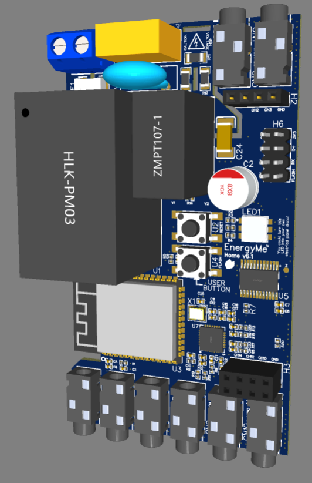
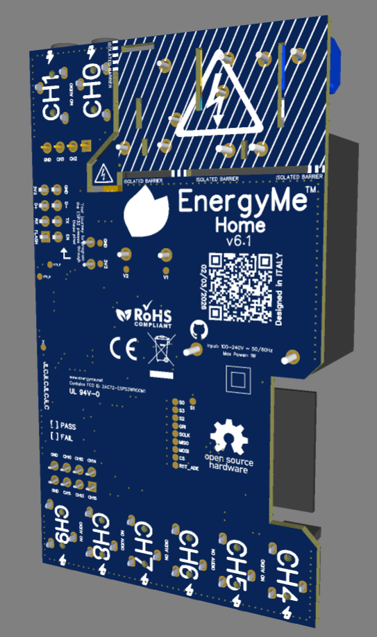

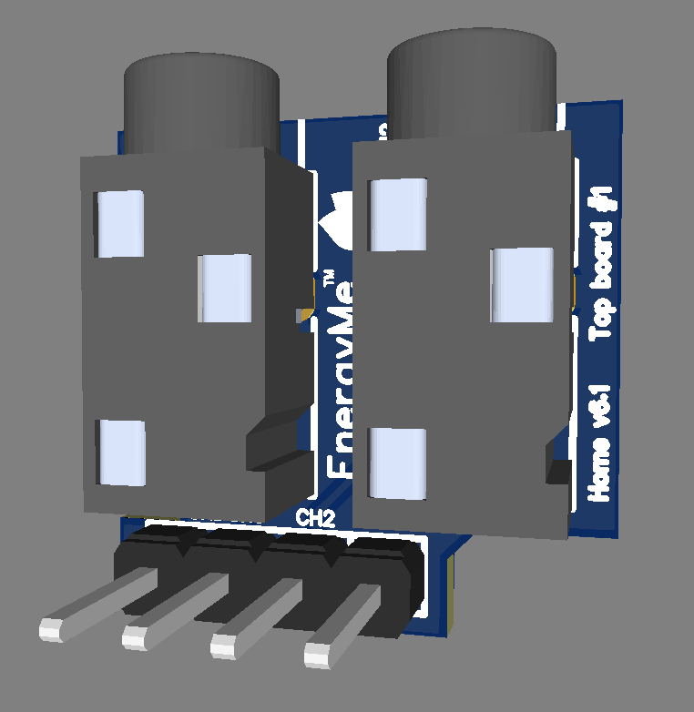
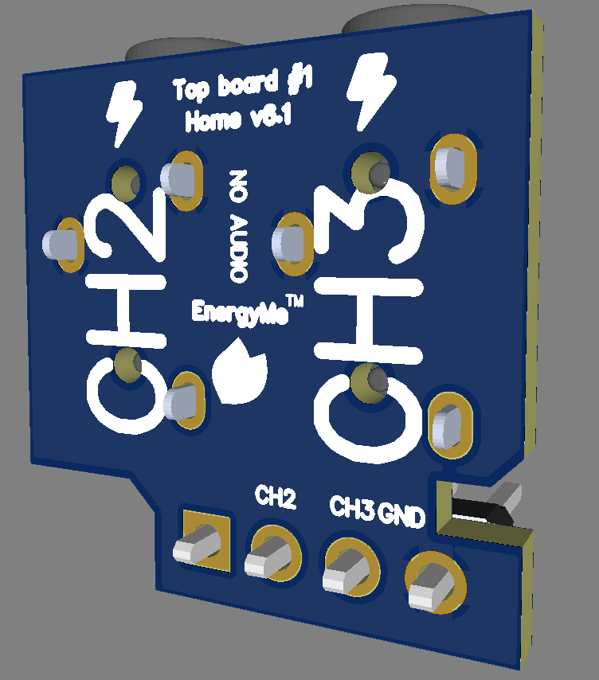

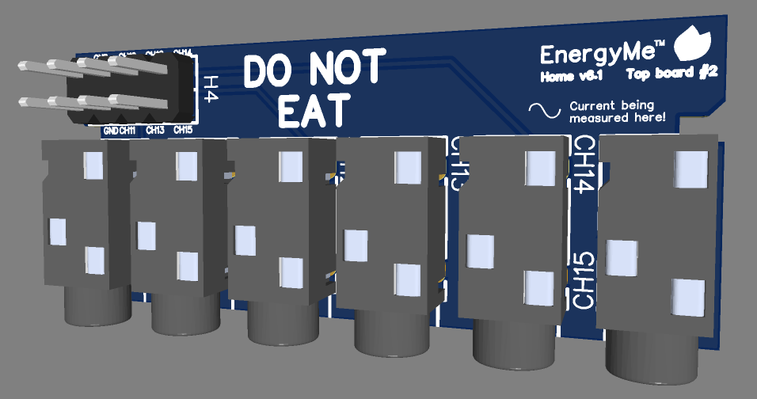
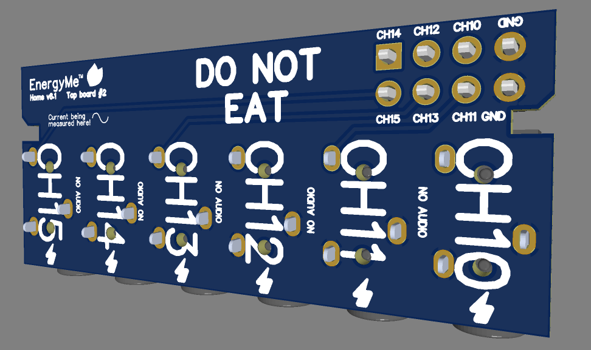

## Hardware Specifications

**Board Information:**

- **Hardware Revision:** v6.1
- **PCB Layers:** 4 layers
- **Board Dimensions:** 87 mm x 50 mm. Height with components around 15 mm
- **Power Consumption:** ~200 mA @ 3.3V typical (~ 1W AC consumption)

**Key Components:**

- **Main Microcontroller:** ESP32-S3-WROOM-1-N16R2 (dual-core, WiFi 2.4 GHz, 16MB Flash, 2MB PSRAM)
- **Energy Measurement IC:** Analog Devices ADE7953ACPZ-RL (single-phase, dual-channel)
- **ADE7953 Oscillator:** 3.58 MHz active SMD oscillator (RO03579043), more compact than a crystal+load-cap pair and requiring no additional passive components
- **Analog Multiplexer:** 74HC4067PW,118 (16-channel, TSSOP-24)
- **CT Inputs:** 16× PJ-3200 3.5mm stereo jacks (1 direct + 15 multiplexed). The plastic housing prevents shorts when stacking the expansion boards on top of the main board.
- **Voltage Transformer:** ZMPT107-1 for AC mains reference with full galvanic isolation
- **Power Supply:** HLK-PM03 AC/DC module (100-240 VAC to 3.3 VDC, 1A max)

**ESP32-S3 Module Compatibility Notes:**

The design uses ESP32-S3-WROOM-1-N16R2 with quad PSRAM (2MB). Other ESP32-S3 variants may work with `platformio.ini` and partition adjustments, but note:

- **N16R8 (8MB Octal PSRAM)**: Octal PSRAM uses GPIOs 35, 36, 37 and such pins are not used for this exact reason, thus making it compatible with the current design. However, the firmware is not tested on this variant yet.
- **N16R0, N8R0, N4R0 (No PSRAM)**: May work with firmware adjustments but not tested - PSRAM used for queues and JSON documents throughout the code
- **N16R2, N8R2, N4R2 (2MB Quad PSRAM)**: Should work with partition table adjustments. Compiled firmware ~2MB (see [issue #21](https://github.com/jibrilsharafi/EnergyMe-Home/issues/21))

## Circuit Design Overview

### 1. Power Supply Unit

The *HLK-PM03* AC/DC module provides isolated 3.3V DC from universal AC input (100-240 VAC, 50-60 Hz). It is suitable for any region and more than enough for the low power requirements of the board.

The power supply section includes:

- **Protection components**
  - Fuse (500 mA slow-blow) on the AC line for overcurrent protection
  - Varistor (MOV) for surge protection
  - PCB slots for physical isolation and safety compliance
- **EMI suppression components**
  - Class X2 100nF film capacitor across the AC line for mains EMI suppression
  - Large 3300µF bulk capacitor on the DC rail for hold-up time after grid loss, allowing the ADE7953 to detect missing voltage reference and for the firmware to dispatch a last-gasp MQTT message before power fails.
  - SMD 1 nF capacitor on the secondary side of the voltage transformer to stitch the floating output to analog ground, suppressing common-mode noise introduced by the isolation barrier

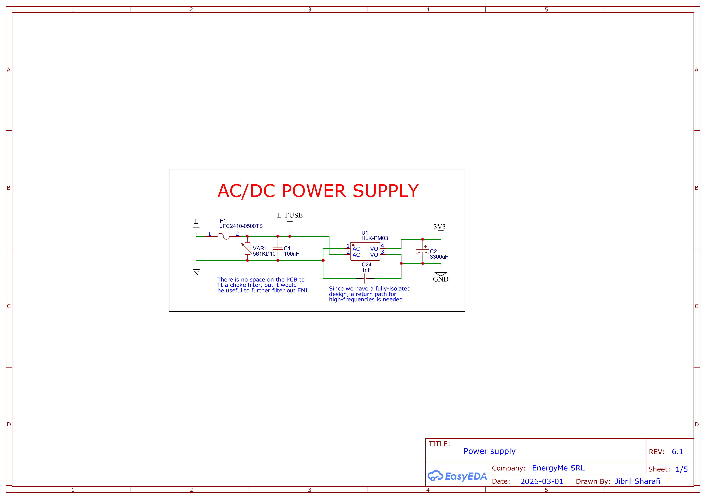

### 2. Microcontroller (ESP32-S3)

*ESP32-S3-WROOM-1-N16R2*: the central processing unit managing all digital logic, SPI communication with ADE7953, multiplexer control, LED control, and wireless connectivity. *The beast*.

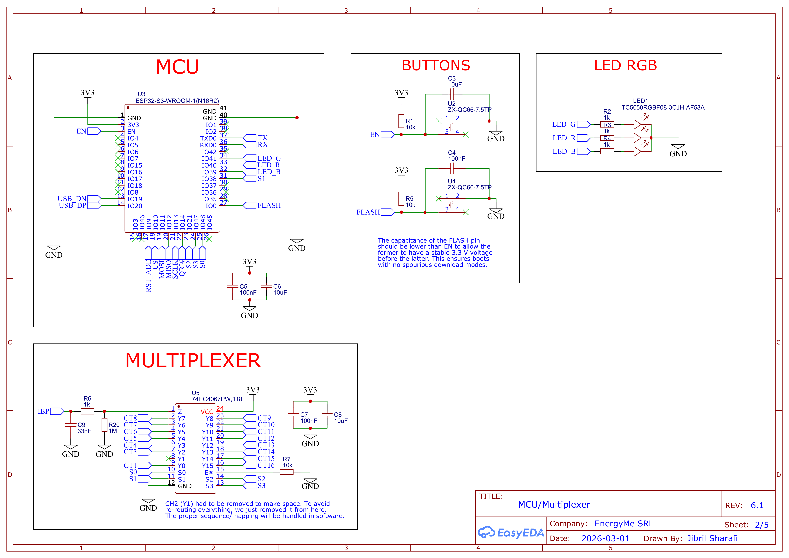

### 3. Energy Measurement (ADE7953)

High-precision 24-bit energy metering IC (*ADE7953ACPZ-RL*) with dual current channels (A and B), clocked by a 3.58 MHz active SMD oscillator, and low-pass filters on all analog inputs (1 kΩ / 33 nF). Key features:

- **Voltage Input:** AC mains reference via ZMPT107-1 voltage transformer (full galvanic isolation)
- **Channel A:** Direct CT input for main circuit monitoring (usually the grid in single phase systems)
- **Channel B:** Multiplexed input from 15 branch circuits
- **Communication:** SPI interface to ESP32-S3 at 2 MHz, with an interrupt line for data-ready notifications (IRQ)

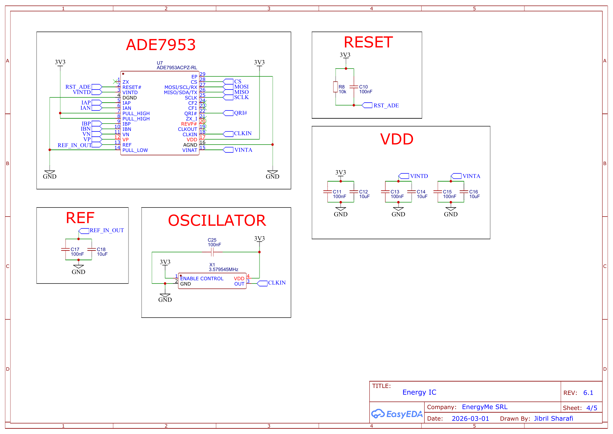

### 4. Analog Multiplexing

*74HC4067PW,118* multiplexer routes one of 15 CT signals to ADE7953 Channel B. ESP32-S3 controls select lines (S0-S3) for sequential measurement. Supports +- 0.5 V relative to ground, which is sufficient for voltage-output CTs (max 333 mV).

### 5. CT Interface & Other Inputs

All 16 CT inputs use PJ-3200 3.5mm stereo jacks with direct connection through low-pass filters (1 kΩ / 33 nF). **Maximum CT output: 333 mV**. No burden resistors are present on the board. 1 MΩ resistors are placed on the CT inputs to guarantee 0 V readings on the ADE7953 when no CT is connected, preventing floating inputs from causing spurious measurements. The PJ-3200 plastic housing is important when stacking the top expansion boards on top of the main board, as it prevents accidental shorts between the jack body and the board above.

The line voltage is fed to the ZMPT107-1 voltage transformer via a 2.54mm 2-pin screw terminal block, rated for 300V/3A.

The programming header is a standard 2x4 2.54mm pin header, comprising of 3V3, GND, EN, IO0, TX, RX, D+, D- pins.

Two more headers are available for expanding the CT inputs up to 16 total channels (the bare board has 8 channels).

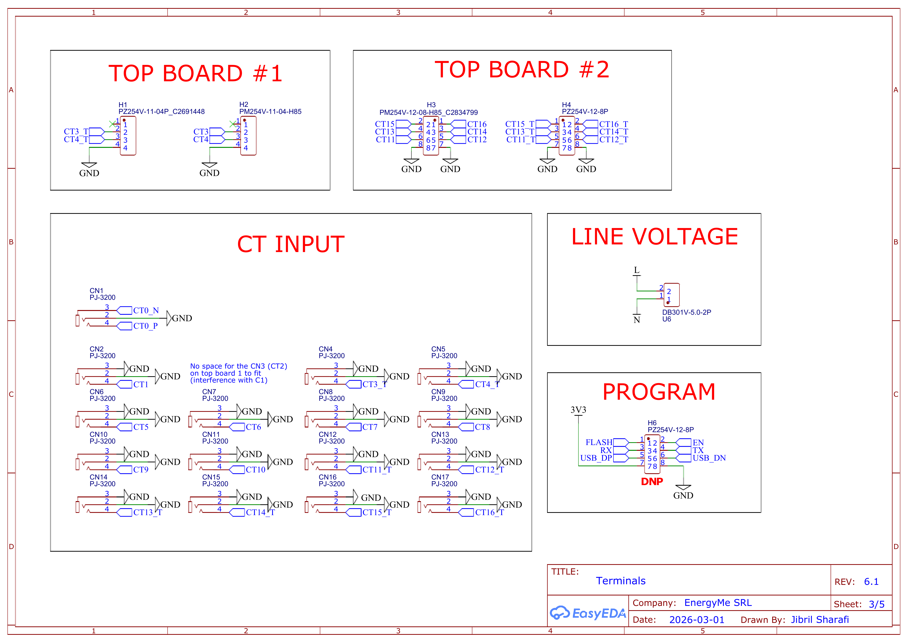

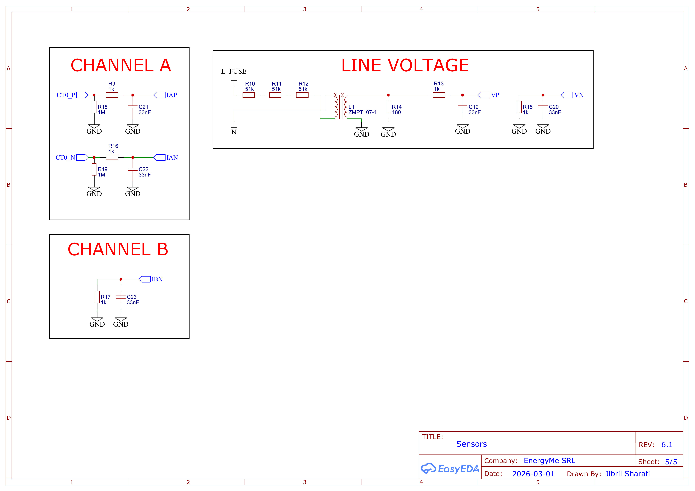

## PCB Layout & Design

The main board features a **4-layer PCB** design. The components, present only on the top side, are both SMD and through-hole, with the majority being SMD for compactness.

**Layer Stack-up:**

- **Layer 1 (Top):** Signal routing, components
- **Layer 2:** Ground plane (continuous pour for low impedance)
- **Layer 3:** Power plane (3.3V distribution)
- **Layer 4 (Bottom):** Signal routing

**Component Placement:**

- **Power section** isolated on top-left side with HLK-PM03 AC/DC module and ZMPT107-1 voltage transformer
- **ESP32-S3** positioned on the left side, leaving a slot under the PCB antenna on the module to improve WiFi performance
- **ADE7953** placed close to the ESP32-S3 to minimize SPI trace lengths
- **Multiplexer** positioned close to the ADE7953 to reduce analog signal path lengths
- **CT jacks** arranged in rows along board edges for easy access
- **RGB LED** near the center for status indication
- **Tactile buttons** for user input located at the center for easy access
- **Programming header** located at the center for easier access
- **Expansion headers** near the CT jacks for additional channels

**Main Board Layout:**

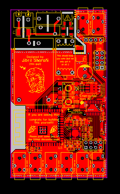

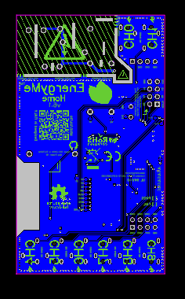

## Design Files & Resources

All design files (PCB layouts, BOMs, Gerber files, Pick-and-Place files) are grouped by board (main_board, top_board_1, top_board_2), while the schematics are provided in a single PDF.

- **EasyEDA Project:** [OSHWLAB | EnergyMe - Home](https://oshwlab.com/jabrillo/multiple-channel-energy-meter)
- **Schematics:** `pcb/schematics.pdf` (PNG pages: `pcb/schematics_page_1.png` to `pcb/schematics_page_5.png`)
- **BOM:** `pcb/main_board/bom_main_board.csv`, `pcb/top_board_1/bom_top_board_1.csv`, `pcb/top_board_2/bom_top_board_2.csv`
- **Gerber Files:** `pcb/main_board/gerber_main_board.zip`, `pcb/top_board_1/gerber_top_board_1.zip`, `pcb/top_board_2/gerber_top_board_2.zip`
- **PCB Layout PDFs:** `pcb/main_board/pcb_main_board_top.pdf`, `pcb/main_board/pcb_main_board_bottom.pdf`, `pcb/top_board_1/pcb_top_board_1_top.pdf`, `pcb/top_board_1/pcb_top_board_1_bottom.pdf`, `pcb/top_board_2/pcb_top_board_2_top.pdf`, `pcb/top_board_2/pcb_top_board_2_bottom.pdf`
- **Pick-and-Place Files:** `pcb/main_board/pick_and_place_main_board.csv`, `pcb/top_board_1/pick_and_place_top_board_1.csv`, `pcb/top_board_2/pick_and_place_top_board_2.csv`
- **EasyEDA Backup:** `pcb/backup_easy_eda/` (schematic and PCB JSON files)
- **Component Datasheets:** Available in `components/` directory

## Hardware Versions and Compatibility

Firmware 2.0.0 selects its hardware profile at runtime from the NVS key `factory_ns::pcb_revision`, matched against the entries in `source/src/hardware_profile.cpp::PCB_PROFILES[]`.

- **v6.1** (current production): 16 channels (1 direct + 15 multiplexed via 74HC4067), ZMPT107-1 voltage transformer.
- **v5 and earlier**: not supported by 2.0.x firmware. Existing v5 devices stay on the 1.x line; critical fixes are cherry-picked to the `legacy/v5` branch.
- **Community / self-built boards** (no factory NVS provisioning): the firmware falls back to the profile selected by the `-DPCB_VERSION_FALLBACK` build flag in `platformio.ini` (or to `PCB_PROFILES[0]` if unset) and starts in **community mode**: cloud services are disabled, all local integrations (REST API, Modbus TCP, custom MQTT, InfluxDB) remain fully functional.

## Safety Notes

⚠️ **ELECTRICAL SAFETY WARNING**

This device interfaces with AC mains voltage. Construction and installation must only be performed by qualified individuals with proper knowledge of electrical safety. Improper handling can result in serious injury or death.

## Hardware Images

**Top view (bare PCB):**

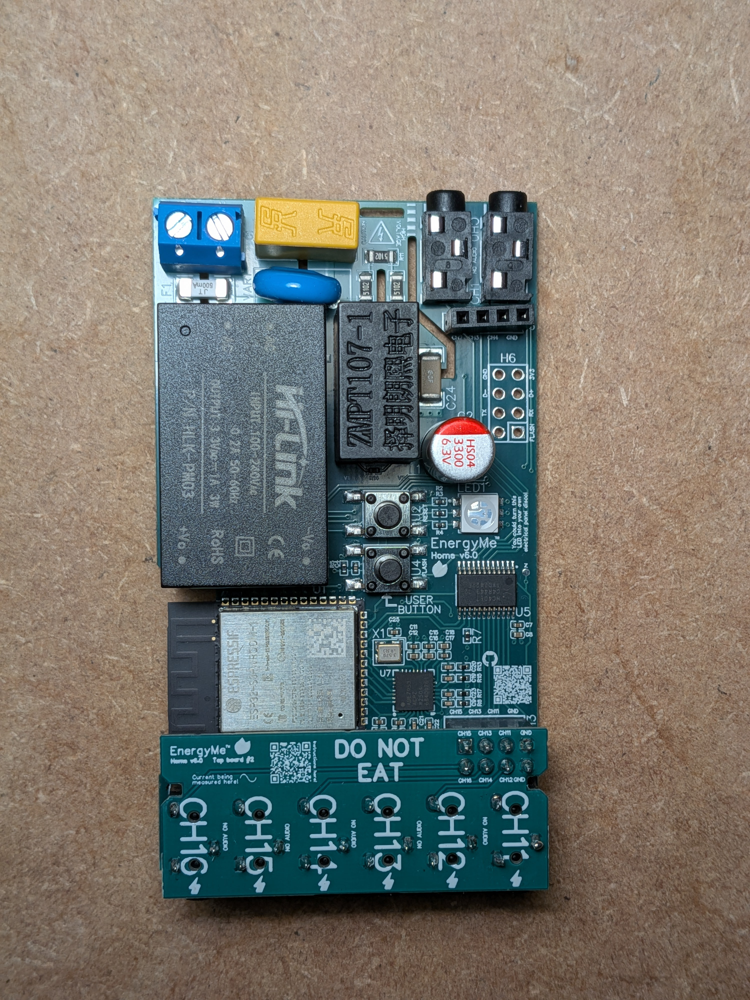

**Bottom view (bare PCB):**

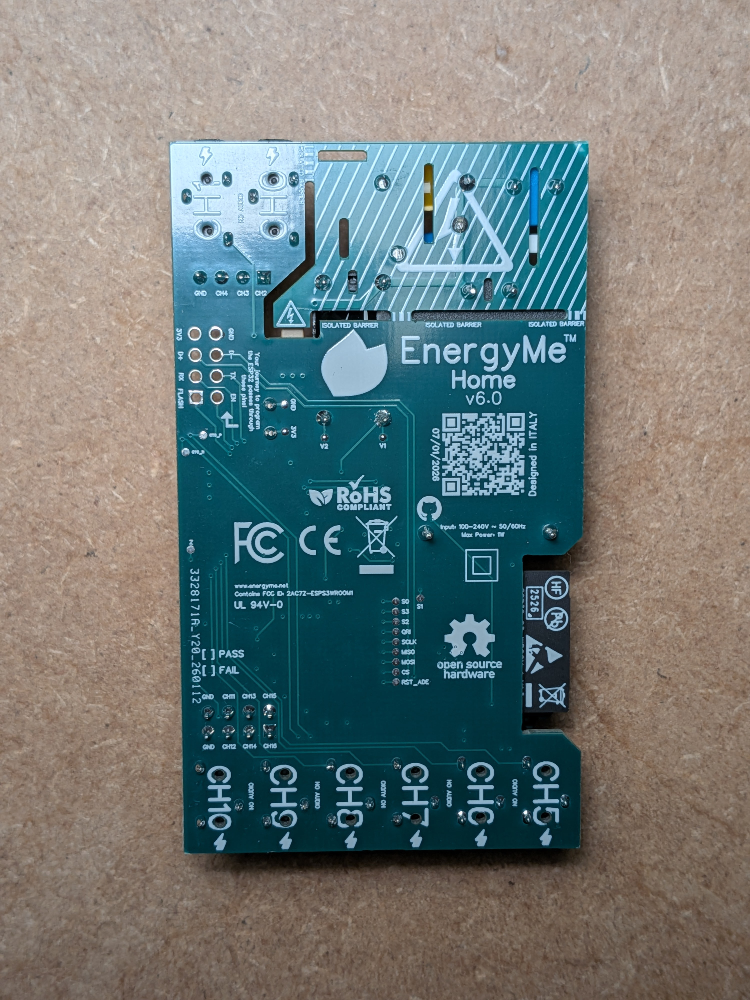

**Top view (assembled):**

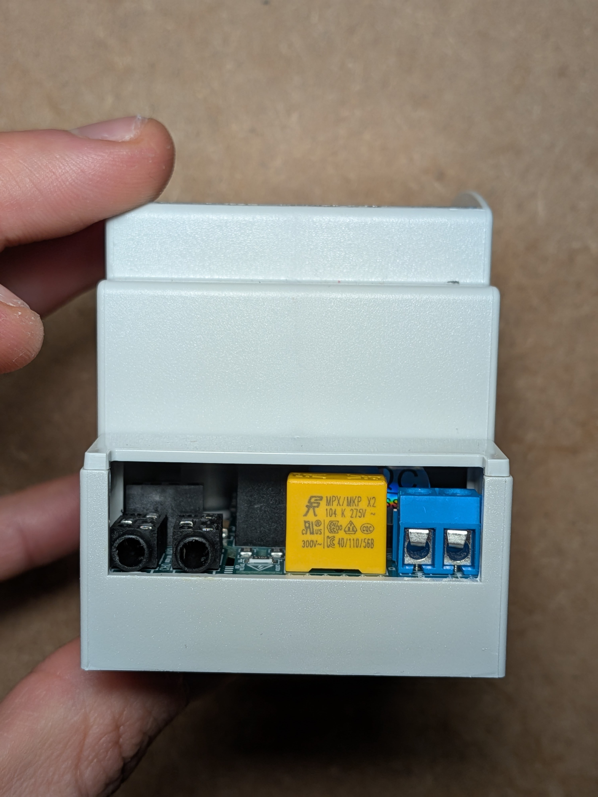

**Bottom view (assembled):**

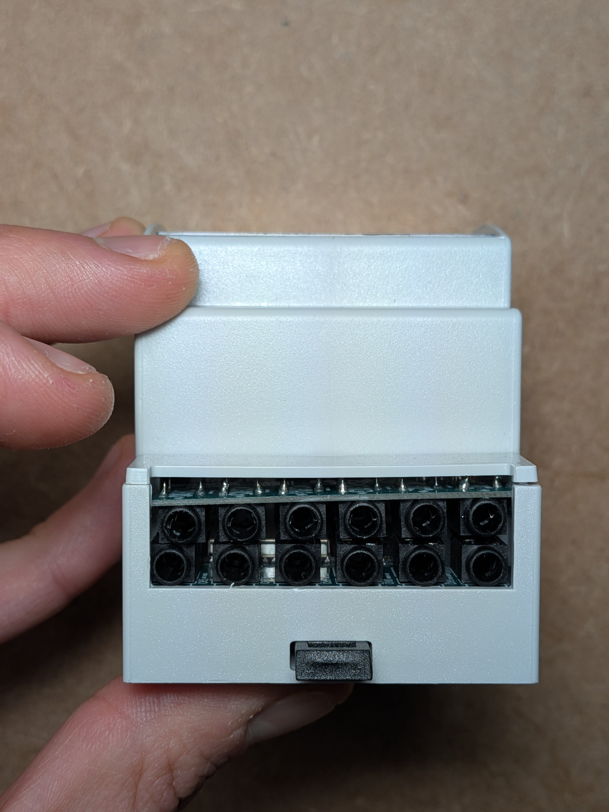

**Front:**

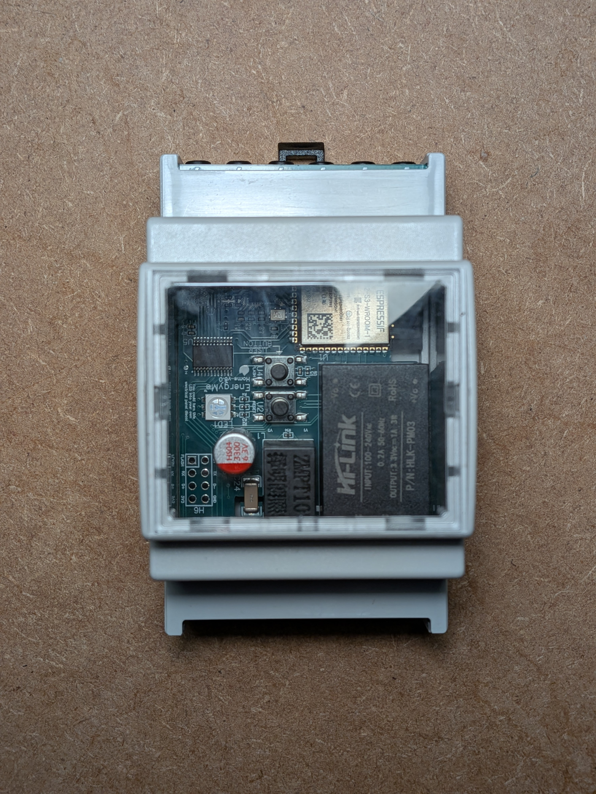

**Back:**

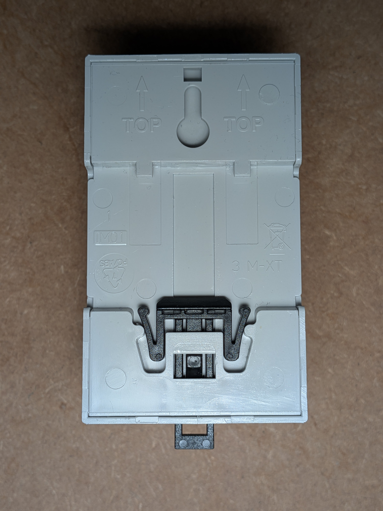

**Left:**

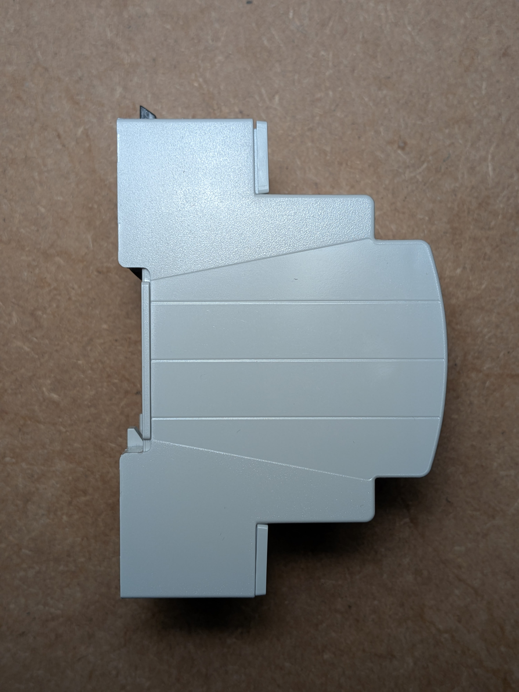

**Right:**

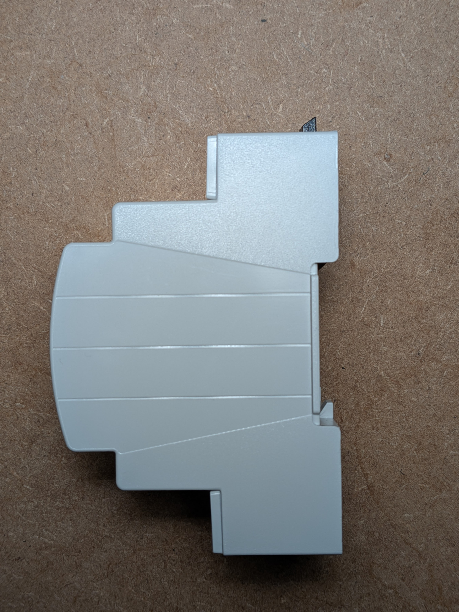

**With CTs connected:**

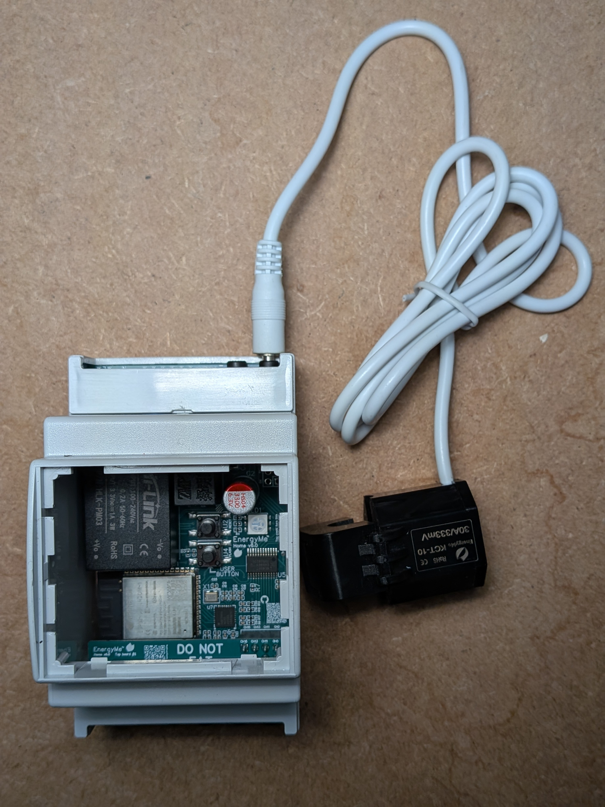

**CT jack detail:**

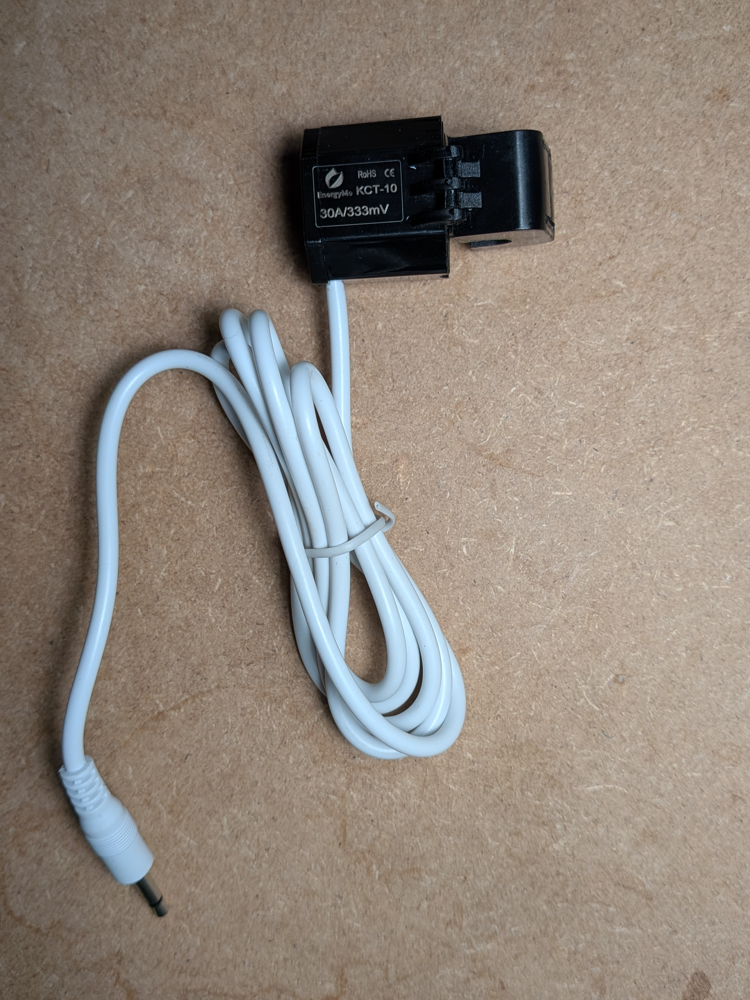
