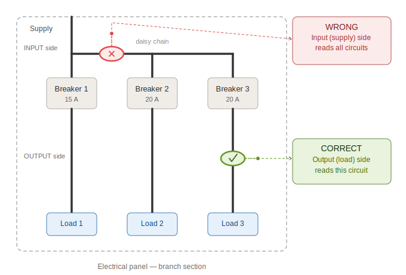

# EnergyMe Home: Installation Manual

**Document version:** 0.8 (draft)  
**Product:** EnergyMe Home  
**Audience:** End user with a qualified electrician for the panel work  
**Language:** English

---

## Before you start: Read this page

> *"You're about to discover things you never knew were happening behind your walls."*

Welcome. In the next 15 minutes, your home is going to stop being a black box. You're going to see, for the first time, exactly where your energy goes: which circuits eat it during the night, which appliances are quietly draining your wallet, which lights you forgot on three years ago.

Some users discover their fridge consumes more than their TV. Some find a phantom load that's been running for years. A few discover their solar panels are producing less than they should. **Whatever your home is hiding, EnergyMe is about to reveal it.**

Hold tight. This is going to be interesting.

---

*EnergyMe - Home* connects directly to the AC mains inside your electrical panel. Working inside an electrical panel is **dangerous** if you don't know what you are doing.

| You can do yourself | You need a qualified electrician |
| --- | --- |
| Open the box and identify the parts ([1](#1-whats-in-the-box)) | Anything inside the electrical panel ([3](#3-electrical-installation)) |
| Configure Wi-Fi and the web interface ([4](#4-software-configuration)) | Switching off the main breaker |
| Map circuits to channels in the UI ([4.5](#45-configure-each-channel)) | Connecting L / N to the device |
| | Clamping the CTs around the wires |

> **⚠ WARNING: Electrical hazard**  
> Do not open your electrical panel with the main breaker ON. Mains voltage can kill. If you have any doubt, **stop and call a qualified electrician**. The installation must comply with **your local electrical codes and regulations**. EnergyMe S.r.l. is not liable for installations performed by unqualified personnel or in violation of local codes.

---

## 1. What's in the box

### 1.1 Starter Kit (always included)

| # | Item | Qty | Notes |
| --- | --- | --- | --- |
| 1 | *EnergyMe Home* device | 1 | Pre-assembled, 3-module DIN-rail mount, with L/N wires already connected. **Channels are numbered 0 to 15 on the front stickers** (16 channels total, 4 on the top and 12 on the bottom) |
| 2 | CT clamps (30 A, 1 m cable, 3.5 mm jack) | 4 | All identical; the rating "30 A" is printed on each clamp body. 1 will be used for **Channel 0** (main line) and 3 for branch circuits |

You'll also find a **"Let's get started" sticker with a QR code** placed inside the lid of the box.

> *And if you're reading these instructions: nice work, you already found the QR code. 🎯*

### 1.2 Expansion Kit (optional, if ordered)

If you ordered additional CTs to monitor more than 3 branch circuits, you'll find them in a separate bag inside the box. The device supports up to **16 channels in total** (Channel 0 for the main and Channels 1 to 15 for branches).

> **ⓘ NOTE: About the CTs**  
> The standard CTs are **30 A rated** (printed on each clamp). They work without issues for **single-phase systems up to ~7 kW at 230 V, or ~3.5 kW at 120 V**.
>
> Before clamping any CT, check the current rating printed on the breaker the CT will monitor; it must not exceed the CT rating. If you have circuits drawing higher current (power supply, heat pump), or a three-phase supply, you may need higher-rated CTs (75 A or 150 A). Contact us at `support@energyme.net` to order them.

> **ⓘ NOTE: Grid frequency**  
> *EnergyMe Home* works on both **50 Hz** (Europe, Asia, Africa, Oceania) and **60 Hz** (North America, parts of South America and Japan) grids with no configuration needed.

> **ⓘ NOTE: If anything is missing or damaged**  
> Do not install the device. Contact support at `support@energyme.net` with a photo of the box content.

> **⚠ Three-phase loads: read this before continuing**  
> If your main supply is **three-phase**, or if you have **specific three-phase loads** to monitor (e.g., a three-phase EV charger), the wiring is slightly different. **Read Appendix B before starting the installation.**

---

## 2. What you need (not included)

**The electrician will need:**

- Insulated screwdriver
- **3 free contiguous DIN modules** in your electrical panel

**You will need:**

- A smartphone, tablet or laptop with Wi-Fi (2.4 GHz)
- Your home Wi-Fi network name (SSID) and password

---

## 3. Electrical installation

> **Before you open the panel:**
>
> 1. Open the panel cover and visually identify **3 free contiguous DIN modules** for the device.
> 2. **Switch OFF the main breaker.**
>
> From this point on, the work is genuinely simple; most installers complete it in **10 to 15 minutes**.

> **⚠ WARNING: From this section onwards, the work must be done by a qualified electrician.**  
> Verify the absence of voltage with a tester on every conductor you will touch.

### 3.1 Mount the device on the DIN rail

1. In the 3-module space you identified, hook the **top** of the device on the rail first.
2. Push the **bottom** until the spring clip clicks.
3. Pull gently downwards to verify the device is locked in place.

### 3.2 Connect the power supply (L and N)

The device comes with **two wires already connected** to the internal power terminal: a **brown wire (Line)** and a **blue wire (Neutral)**. You only need to connect the free ends of these wires to the **nearest Line and Neutral references** in the panel.

1. Connect the **brown wire (Line)** to the nearest available Line reference, typically the Line side of any breaker in the panel.
2. Connect the **blue wire (Neutral)** to the **Neutral bar** of the panel (the common neutral terminal block).
3. Tighten the screws firmly.

> **ⓘ NOTE: Custom wiring**  
> If the provided wiring is not suitable for your application, it is possible to use your own wires.
>
> To do so, lift the plastic cover of the power terminal on the device, unscrew and disconnect the brown and blue wires, and connect your own wires to the same terminals, following the same Line/Neutral convention. Then put the cover back on.
>
> Make sure to use wires of appropriate gauge and insulation for mains voltage.

### 3.3 Install the CT on Channel 0 (main line)

The CT on **Channel 0** is the most accurate channel and should be used to measure the total energy entering your home.

1. Take **one** of the CT clamps from the kit (any of them, they're all identical).
2. Identify the **main line conductor** downstream of the main breaker (typically the brown/black wire coming from the kWh meter into the panel).
3. Open the CT clamp.
4. Clamp it **around the single Line conductor only**. Never clamp around L and N together; the magnetic fields cancel out and you would read zero. It is possible to also clamp around the neutral.
5. Close the clamp until you hear/feel the click.
6. Plug the 3.5 mm jack into the socket marked **`0`** on the device (the channel numbers are printed on the top front sticker).

> **ⓘ NOTE: Clamp direction doesn't matter**  
> The CT clamps are not directional. If you discover later (in [4.7](#47-verification)) that the readings on a channel are inverted (e.g., negative when you expect positive), you don't need to reopen the panel. Just check the **Reverse** box for that channel in the web interface and the sign flips instantly.

> **⚠ Three-phase main supply**  
> If your main supply is three-phase, the CT on Channel 0 goes on **one of the three phases**, and you'll need additional CTs on the other two phases (on free branch channels). See **Appendix B**.

### 3.4 Install the CTs on the branch channels (1 to 15): Critical step ⚠

This is the step where most installation mistakes happen. **Read this section before clamping anything.**

#### 3.4.1 The "shared input wire" problem

Inside an electrical panel, breakers can be fed in **daisy-chain** on the **input** side: the supply line enters breaker #1, then jumps to breaker #2, then to breaker #3, and so on. This has a major consequence for measurement:

> **⚠ The wire on the INPUT (top) side of a breaker carries the current of THAT breaker AND of all the breakers downstream of it in the chain.**  
> If you clamp the CT on the input wire, you will read the **sum of multiple circuits**, which is wrong.

The wire on the **OUTPUT (bottom) side** of the breaker carries **only** the current of the loads connected to that specific breaker. **This is where the CT must go.**

#### 3.4.2 The rule

> **Always clamp the branch CTs on the OUTPUT (load) side of the breaker, meaning the wire that leaves the breaker and goes to the loads in the house. Never on the input bus.**

#### 3.4.3 Step-by-step for each branch CT

For each circuit you want to monitor:

1. Decide which breaker you want to monitor (e.g., "kitchen", "lights", "washing machine").
2. Locate the **output** wire of that breaker, the one leaving the bottom terminal towards the loads. **Not** the input wire on top.
3. Open the CT clamp.
4. Clamp it **around the single Line conductor** of that output wire. Not around L+N together, not around the protective earth (yellow/green wire). Neutral also works fine.
5. Close the clamp until it clicks.
6. Plug the 3.5 mm jack into a free socket on the device, **numbered 1 to 15** (the channel numbers are printed on the front stickers).
7. **If you know what circuit it is, write down the channel number and the breaker label** (e.g., "Channel 2 → Garden lights"). You'll use this in [4.5](#45-configure-each-channel) to give each channel a meaningful name in the UI. Use the table in Appendix A.

> **✅ TIP: Don't know what each breaker controls?**  
> No problem. Plug the CTs into any free channels and proceed with the installation. Once the device is online you can rename the channels at any time from the web interface.

> **⚠ WARNING: Common mistakes to avoid**
>
> - ❌ Clamping on the **input** wire of a breaker (reads multiple circuits)
> - ❌ Clamping on the **comb bar** (reads the sum of all breakers on the comb)
> - ❌ Clamping around **both** L and N (reads zero)
> - ❌ Clamping around the **protective earth** (reads zero in normal conditions, may read fault currents otherwise)
> - ❌ Forcing the clamp on a wire that is too thick; the jaws must close fully and click

> **⚠ Three-phase branch loads**  
> If a specific load you want to monitor is three-phase (e.g., a three-phase EV charger or heat pump), see **Appendix B** before clamping.

### 3.5 Final check before closing the panel

Before turning the main breaker back ON:

| Check | OK? |
| --- | --- |
| All CT jacks are fully inserted in the device (1 on Channel 0, the others on Channels 1-15) | ☐ |
| Brown (L) and Blue (N) wires from the device are tightly connected, no copper visible | ☐ |
| Channel 0 CT is on the main Line conductor | ☐ |
| Each branch CT is on the OUTPUT side of its breaker (not on the comb bar) | ☐ |
| No tools or screws left inside the panel | ☐ |
| Channel map (Appendix A) filled in (where known) and photographed | ☐ |
| Panel cover ready to be re-installed | ☐ |

### 3.6 First power-on

1. Close the panel cover.
2. Turn the main breaker **ON**.
3. Watch the LED on the front of the device.

> **ⓘ NOTE: Boot sequence colours**  
> During the first ~10 seconds the LED cycles through several colours in quick succession (yellow, orange, purple, and others). **This is entirely normal;** each colour marks a stage of the startup sequence. Do not act on any of them; wait until the LED settles.

After boot, three outcomes are possible:

| LED behaviour | Meaning | Next step |
| --- | --- | --- |
| 🔵 Blue, fast blink | No Wi-Fi configured yet; captive portal active | Go to **[4.1](#41-connect-to-the-devices-wi-fi-captive-portal)** |
| 🔵 Blue, slow pulse | Known Wi-Fi found but not yet connected (e.g. router still booting) | Wait up to 60 s; LED should settle to solid green |
| 🟢 Solid green | Connected to home Wi-Fi, monitoring | Go to **[4.3](#43-access-the-web-interface)** (skip [4.1](#41-connect-to-the-devices-wi-fi-captive-portal) and [4.2](#42-configure-your-home-wi-fi)) |

> **⚠ WARNING**  
> If you smell anything burning, hear buzzing, or see smoke: **switch the main breaker OFF immediately** and contact support before doing anything else.

---

## 4. Software configuration

From now on, the work can be done by the end user. The electrical panel can stay closed.

### 4.1 Connect to the device's Wi-Fi (captive portal)

On first power-on, or after a Wi-Fi reset, the device broadcasts its own Wi-Fi network so you can configure it.

1. On your phone or laptop, open Wi-Fi settings.
2. Look for a network named **`EnergyMe-<DEVICE_ID>`**, where `<DEVICE_ID>` is the 12-character code printed on the label inside the device case.
3. Connect to it. The password is:
   - **EnergyMe devices** (purchased from us): printed on the stickers on the case, both as a scannable QR code and as plain text.
   - **Community devices** (self-built): the `DEVICE_ID` itself (same 12-character code as the network name).
4. A configuration page opens automatically. If it does not, open a browser and navigate to **`http://192.168.4.1`**.

> **ⓘ NOTE: If the network doesn't appear**  
> Wait 60 seconds after power-on. If it still isn't visible, hold the button for 10-15 seconds until the LED turns orange (Wi-Fi reset), then release. The device will restart and open the portal again. See **Appendix D** for the full button reference.

### 4.2 Configure your home Wi-Fi

In the captive portal page:

1. Go to **Configure Wi-Fi**.
2. Select your home Wi-Fi network from the list.
3. Enter your Wi-Fi password.
4. Tap **Save**.
5. The device restarts and connects to your home network, which takes about 30 seconds. The LED will stop blinking blue and settle to **solid green** once connected.

> **✅ TIP: 2.4 GHz only**  
> *EnergyMe Home* uses **2.4 GHz Wi-Fi**. If your router shows separate 2.4 GHz and 5 GHz networks, pick the 2.4 GHz one. If your router uses a single combined name ("band steering"), it will usually work fine, but if you have connection problems, ask your router's admin page to expose the 2.4 GHz band as a separate SSID.

### 4.3 Access the web interface

1. On a phone or laptop connected to **the same home Wi-Fi**, open a browser.
2. Navigate to **`http://energyme.local`**.
3. Log in with the default credentials:
   - **Username:** `admin`
   - **Password:** `energyme`

> **ⓘ NOTE: Note down the IP address**  
> Once logged in, go to **Info** in the top menu. Under **Network Status**, you will see the device's local IP address (e.g. `192.168.1.42`). **Write it down or bookmark it.** If `energyme.local` stops resolving in the future (some routers, PCs, and older Android versions don't handle `.local` names reliably), you can always reach the interface directly by typing that IP address into your browser.
>
> If you haven't noted the IP yet and `energyme.local` no longer works, open your router's admin page and look for a device with hostname `energyme-home-<DEVICE_ID>`.

### 4.4 Change the default password

> **⚠ Do this before anything else.** The device ships with a known default password. Until you change it, anyone on your home network can access the interface.

1. In the top menu, go to **Configuration**.
2. Scroll to **Change Password**.
3. Enter the current password (`energyme`), then your new password twice. The new password must be at least 8 characters.
4. Click **Save**.

The device will remind you with a pop-up on the dashboard every time you open it, until the password has been changed.

> **ⓘ NOTE: Forgot your password?**  
> Hold the button for 5-10 seconds until the LED turns yellow (password reset), then release. The password is reset to `energyme`. Log back in and set a new one straight away. See **Appendix D** for the full button reference.

### 4.5 Configure each channel

Now you map each physical CT to a meaningful name and role in the UI. Go to **Channels** in the top menu and configure each channel that has a CT connected.

Each channel has the following fields:

| Field | What it means |
| --- | --- |
| **Label** | A free-text name (e.g., "Grid", "Kitchen", "EV charger"). It's the name that will appear on the dashboard |
| **Phase** | The phase the CT is clamped on. Use `1` for single-phase systems. For three-phase, see Appendix B |
| **Reverse** | Tick this if the channel reads with the wrong sign (e.g., shows -8 W when you expect +8 W). Flips the sign instantly, no need to reopen the panel |
| **Active** | Enables the channel. Untick for unused channels |
| **Grouping** | Channels sharing the same group label are combined into one card on the home dashboard. Use this for multi-phase loads: set all three phase CTs of your oven to "Oven" and the dashboard will show total power for the whole appliance |
| **Role** | What the channel represents (see table below) |

#### Role values

| Role | When to use |
| --- | --- |
| `Load` | A branch circuit consuming energy (kitchen, lights, appliances, EV charger, heat pump...) |
| `Grid (+ import, - export)` | The main supply line. Positive when importing from the grid, negative when exporting (e.g. PV selling back) |
| `PV / Solar (+ generation)` | A solar panel string measured directly (AC side). Positive when generating |
| `Battery (+ discharge, - charge)` | A battery system. Positive when discharging to the home, negative when charging |
| `Inverter (PV + Battery DC-coupled)` | A hybrid inverter where PV and battery share a single AC output |

#### Configuration for a typical single-phase home

**Channel 0 (main line):**

| Field | Value |
| --- | --- |
| Label | `Grid` (or `Main`, or your preference) |
| Phase | `1` |
| Reverse | (leave unchecked, fix later if needed) |
| Active | ☑ |
| Grouping | `Group 0` (default) |
| Role | `Grid (+ import, - export)` |

**Channels 1 to 15 (branch loads):**

| Field | Value |
| --- | --- |
| Label | The breaker label from Appendix A (e.g., "Kitchen") |
| Phase | `1` |
| Reverse | (leave unchecked, fix later if needed) |
| Active | ☑ for channels with a CT, ☐ for unused channels |
| Grouping | One group per channel by default (e.g., `Group 1`, `Group 2`...). Change only if you want to combine channels on the dashboard (see Appendix B for three-phase loads) |
| Role | `Load` (or `PV / Solar`, `Battery`, `Inverter` if applicable) |

Click **Save** for each channel.

> **⚠ Three-phase configuration**  
> If you have three-phase loads (main supply or specific branches), the **Phase** and **Grouping** fields must be configured carefully. See **Appendix B**.

### 4.6 CT calibration: only if using non-standard CTs

> **ⓘ For standard 30 A CTs (the ones included in the kit)**  
> EnergyMe devices are calibrated at the factory. If you are using the supplied 30 A CTs, **skip this section entirely;** no calibration action is needed. Minor differences from a reference meter (well under 1%) are expected and normal.

You need to visit the **Calibration** page if:

- You ordered higher-rated CTs (75 A, 150 A) for high-current circuits; **or**
- You are using a community build with self-sourced CTs.

#### How to calibrate

1. In the top menu, go to **Calibration**.
2. Select the channel you want to calibrate from the drop-down.
3. Set **CT Current Rating (A)** to the value printed on the CT body (e.g. `75` for a 75 A CT). This is mandatory whenever the installed CT differs from the default 30 A.
4. Set **CT Voltage Output (V RMS)** to the voltage the CT outputs at its rated current: `0.333` V for the standard CTs in the kit, or check your CT's datasheet.

   > **⚠ Do not exceed 0.5 V output at your maximum expected current;** this is the ADE7953 measurement IC's safe input limit. For example, a 75 A / 1 V CT is fine if the circuit will never exceed ~37 A (half the rated current), but not for a fully loaded 75 A circuit.

5. Leave **Scaling Factor (%)** at `0` unless you are trimming a residual error against a known reference meter. Adjustment range is in 0.1% steps; only touch this if you have a calibrated reference to compare against.
6. Click **Save**.

Repeat for every channel that uses a non-standard CT.

### 4.7 Verification

| Check | When | Expected | If wrong |
| --- | --- | --- | --- |
| Voltage | Within seconds | Your nominal grid voltage (~120 V or ~230 V depending on your region) | Re-check L/N connection |
| Channel 0 power (W) when importing from grid | Within seconds | **Positive** (importing energy) | If consistently negative when you know you're importing, tick **Reverse** for Channel 0 |
| Channel 0 power (W) when exporting (PV) | Within seconds | **Negative** | Sign convention is correct: `+ import, - export` |
| Branch channel power (W) on `Load` channels | Within seconds | Positive when consuming | If consistently negative, tick **Reverse** for that channel |
| Sum of `Load` branches is less than or equal to Channel 0 import | Within seconds | Yes | If branches exceed the main, a CT is likely on the input side or comb bar ([3.4](#34-install-the-cts-on-the-branch-channels-1-to-15-critical-step-)) |
| Hourly / daily / monthly energy (kWh) | After a few hours | Numbers populating | The device needs time to accumulate energy data; totals fill in progressively over hours |

> **ⓘ NOTE: Don't worry if the dashboard looks empty at first**  
> Instantaneous power (Watts) appears within seconds. **Aggregated energy values (kWh) take a few hours to populate**, because the device needs to accumulate measurements before showing trends. Check back later in the day.

> **ⓘ NOTE: The Reverse checkbox is your friend**  
> If a channel reads with the wrong sign, you don't need to reopen the panel and flip the CT. Just tick **Reverse** for that channel in [4.5](#45-configure-each-channel); the sign flips instantly.

> **✅ TIP: The "kettle test" (instant verification)**  
> Turn on a single high-power load on a known circuit (e.g., a kettle in the kitchen). You should see the instantaneous power increase **on that one branch channel** and on Channel 0 by approximately the same amount.
>
> - If it appears on **multiple branches**, one of the CTs is on a shared input wire. Go back to [3.4](#34-install-the-cts-on-the-branch-channels-1-to-15-critical-step-).
> - If it appears on the **wrong branch**, the channel-to-breaker mapping in the UI is wrong. Edit the labels in [4.5](#45-configure-each-channel).
> - If it appears on **no monitored branch** but on Channel 0, that circuit isn't monitored yet, which is expected if you didn't put a CT on it.

### 4.8 Firmware updates

The device checks for available firmware updates automatically. When a new version is available, a **bell icon (🔔)** appears next to the Firmware Update button in the top navigation bar.

To update:

1. Go to **Update** in the top menu.
2. Follow the on-screen instructions.

> **ⓘ NOTE: Community devices**  
> Automatic update notifications require cloud services to be enabled. For community (self-built) devices, updates are always manual: download the latest firmware binary from [GitHub Releases](https://github.com/jibrilsharafi/EnergyMe-Home/releases) and upload it via the Update page.

### 4.9 Integrations

*EnergyMe Home* supports several integration options: Custom MQTT, InfluxDB, REST API, Modbus TCP, and mDNS service discovery. All configuration and documentation for these is available directly in the web interface under **Integrations** in the top menu; the page is self-contained and includes everything you need to connect to third-party platforms.

---

## Appendix A: Channel map

Fill in during installation (where known), take a photo before closing the panel.

| Channel # | Breaker label | Description (room/load) | CT rating | Role | Phase | Grouping |
| --- | --- | --- | --- | --- | --- | --- |
| 0 | Main breaker | Whole-home incoming line | 30 A | Grid | 1 | Group 0 |
| 1 | | | 30 A | Load | 1 | Group 1 |
| 2 | | | 30 A | Load | 1 | Group 2 |
| 3 | | | 30 A | Load | 1 | Group 3 |
| 4 | | | | | | |
| ... | | | | | | |
| 15 | | | | | | |

---

## Appendix B: Three-phase configuration

*EnergyMe Home* is fundamentally a single-phase device, but it can monitor a **three-phase main supply** (or specific three-phase loads) by using **one CT per phase** and combining the three readings on the dashboard via the `Grouping` field.

### B.1 Three-phase main supply

#### Hardware

1. Take **3 CTs** from the kit (or expansion kit).
2. Clamp each CT around **one of the three phase conductors** (L1, L2, L3), never around the neutral.
3. Plug them into the device:
   - **Phase L1** → Channel `0` (the main reference channel)
   - **Phase L2** → any free branch channel (e.g., Channel `1`)
   - **Phase L3** → any free branch channel (e.g., Channel `2`)
4. **Write down which physical phase is on which channel;** you'll need it for the software step.

#### Software

In **Channels** ([4.5](#45-configure-each-channel)), set up the three channels like this:

| Channel | Label | Phase | Active | Grouping | Role |
| --- | --- | --- | --- | --- | --- |
| 0 | `Grid L1` | `1` | ☑ | `Grid` | `Grid (+ import, - export)` |
| 1 (or chosen branch) | `Grid L2` | `2` | ☑ | `Grid` | `Grid (+ import, - export)` |
| 2 (or chosen branch) | `Grid L3` | `3` | ☑ | `Grid` | `Grid (+ import, - export)` |

The three channels share the same **Grouping** value (`Grid`), so the dashboard will show a single "Grid" card with the **total three-phase power** of the main supply.

### B.2 Three-phase branch load (e.g., EV charger, heat pump, oven)

#### Hardware

1. Take **3 CTs**.
2. Clamp each CT on one phase of the load.
3. Plug them into 3 free branch channels (e.g., Channels `3`, `4`, `5`).
4. Note down which phase is on which channel.

#### Software

Example for a three-phase EV charger:

| Channel | Label | Phase | Active | Grouping | Role |
| --- | --- | --- | --- | --- | --- |
| 3 | `EV charger L1` | `1` | ☑ | `EV charger` | `Load` |
| 4 | `EV charger L2` | `2` | ☑ | `EV charger` | `Load` |
| 5 | `EV charger L3` | `3` | ☑ | `EV charger` | `Load` |

The dashboard will show a single "EV charger" card with the total three-phase power of the appliance.

> **✅ TIP: Naming the group**  
> Use a clean group name (e.g., `Oven`, `Heat pump`, `EV charger`) without phase suffixes; that's what will appear on the dashboard. Put the phase suffix only in the `Label` of each channel, so you can still inspect individual phases if needed.

---

## Appendix C: LED status reference

The LED on the front of the device communicates the system state at a glance.

> **ⓘ Boot colours**  
> During the first ~10 seconds after power-on the LED cycles through yellow, orange, purple, and other colours briefly. **This is normal.** Each colour marks an internal startup stage. Wait for the LED to settle before drawing any conclusion.

### Normal operation

| LED | State | Meaning |
| --- | --- | --- |
| 🟢 Green, solid | Connected | Wi-Fi connected, monitoring normally |
| 🔵 Blue, slow pulse | Reconnecting | Wi-Fi temporarily lost; reconnecting automatically, usually resolves on its own |
| 🔵 Blue, fast blink | Portal active | No Wi-Fi configured; captive portal is open ([4.1](#41-connect-to-the-devices-wi-fi-captive-portal)) |

### Alerts

| LED | State | Meaning | What to do |
| --- | --- | --- | --- |
| 🟣 Purple, solid | Safe mode | Crash protection triggered; device is still monitoring and fully reachable via the web interface | Go to **Logs** in the top menu to investigate; the device will recover automatically |
| 🔴 Red, fast blink | Critical error | Persistent failure after recovery attempts | Restart via button (Appendix D); if it recurs, contact support |

### Button feedback (while the button is held; see Appendix D)

| LED colour while holding | Action that will trigger on release |
| --- | --- |
| ⚪ White | Press registered but below action threshold. Release for no action |
| 🔵 Cyan | Restart |
| 🟡 Yellow | Password reset to default |
| 🟠 Orange | Wi-Fi reset (re-opens captive portal) |
| 🔴 Red | Factory reset: all data and settings will be erased |
| ⚪ White (again) | Held too long. Release and try again |

---

## Appendix D: User button reference

The button on the front of the device lets you recover from common situations without needing a phone or laptop.

**How it works:** press and hold. The LED changes colour as you hold longer, showing which action will trigger on release. **Release the button as soon as you see the colour for the action you want.**

| Hold time | LED colour | Action on release |
| --- | --- | --- |
| < 2 s | White | No action |
| 2-5 s | **Cyan** | **Restart:** equivalent to a power cycle |
| 5-10 s | **Yellow** | **Password reset:** resets the web password to `energyme` |
| 10-15 s | **Orange** | **Wi-Fi reset:** clears Wi-Fi credentials and reopens the captive portal ([4.1](#41-connect-to-the-devices-wi-fi-captive-portal)). Energy data and channel configuration are preserved |
| 15-20 s | **Red** | **Factory reset** ⚠: erases all data, configuration, and credentials. Use only as a last resort |
| > 20 s | White | No action. Release and try again |

> **⚠ WARNING: Factory reset is irreversible**  
> A factory reset erases all accumulated energy data, channel names, calibration, Wi-Fi credentials, and your custom password. There is no undo. Only hold to red if you are certain.

> **✅ TIP: Colour as confirmation**  
> You don't need to count seconds. Watch the LED: release the moment it shows the colour you want. If you overshoot to white again, keep holding; just release without triggering any action. Then try again from the start.

---

`[⚙ TO ADD: Troubleshooting, Warranty, Disposal (next iterations) and other things required by CE]`
