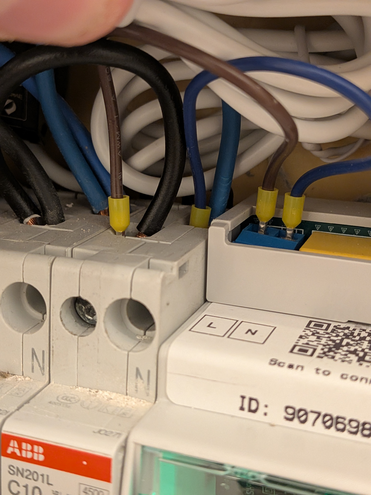
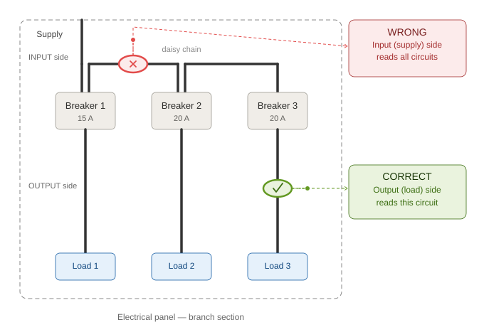

# Installation

> Read the [safety preamble](README.md#before-you-start-read-this-page) before starting.

---

## 1. What's in the box

### 1.1 Starter Kit (always included)

| # | Item | Qty | Notes |
| --- | --- | --- | --- |
| 1 | *EnergyMe Home* device | 1 | Pre-assembled, 3-module DIN-rail mount, with L/N wires already connected. **Channels are numbered 0 to 15 on the front stickers** (16 channels total, 4 on the top and 12 on the bottom) |
| 2 | CT clamps (30 A, 1 m cable, 3.5 mm jack) | 4 | All identical; the rating "30 A" is printed on each clamp body. 1 will be used for **Channel 0** (main line) and 3 for branch circuits |

You'll also find a **"Let's get started" sticker with a QR code** placed inside the lid of the box.

> *And if you're reading these instructions: nice work, you already found the QR code. 🎯*

### 1.2 Expansion Kit (optional, if ordered)

If you ordered additional CTs to monitor more than 3 branch circuits, you'll find them in a separate bag inside the box. The device supports up to **16 channels in total** (Channel 0 for the main and Channels 1 to 15 for branches).

> **ⓘ NOTE: About the CTs**  
> The standard CTs are **30 A rated** (printed on each clamp). They work without issues for **single-phase systems up to ~7 kW at 230 V, or ~3.5 kW at 120 V**.
>
> Before clamping any CT, check the current rating printed on the breaker the CT will monitor; it must not exceed the CT rating. If you have circuits drawing higher current (power supply, heat pump), or a three-phase supply, you may need higher-rated CTs (75 A or 150 A), available from our [website store](https://www.energyme.net/product-home-en).

> **ⓘ NOTE: Grid frequency**  
> *EnergyMe Home* works on both **50 Hz** (Europe, Asia, Africa, Oceania) and **60 Hz** (North America, parts of South America and Japan) grids with no configuration needed.

> **ⓘ NOTE: If anything is missing or damaged**  
> Do not install the device. Open a [GitHub issue](https://github.com/jibrilsharafi/EnergyMe-Home/issues) with a photo of the box content.

> **⚠ Three-phase loads: read this before continuing**  
> If your main supply is **three-phase**, or if you have **specific three-phase loads** to monitor (e.g., a three-phase EV charger), the wiring is slightly different. **Read [Appendix B](appendices.md#appendix-b-three-phase-configuration) before starting the installation.**

---

## 2. What you need (not included)

**The electrician will need:**

- Insulated screwdriver
- **3 free contiguous DIN modules** in your electrical panel

**You will need:**

- A smartphone, tablet or laptop with Wi-Fi (2.4 GHz)
- Your home Wi-Fi network name (SSID) and password

---

## 3. Electrical installation

> **Before you open the panel:**
>
> 1. Open the panel cover and visually identify **3 free contiguous DIN modules** for the device.
> 2. **Switch OFF the main breaker.**
>
> From this point on, the work is genuinely simple; most installers complete it in **10 to 15 minutes**.

> **⚠ WARNING: From this section onwards, the work must be done by a qualified electrician.**  
> Verify the absence of voltage with a tester on every conductor you will touch.

### 3.1 Mount the device on the DIN rail

1. In the 3-module space you identified, hook the **top** of the device on the rail first.
2. Push the **bottom** until the spring clip clicks.
3. Pull gently downwards to verify the device is locked in place.

### 3.2 Connect the power supply (L and N)

The device comes with **two wires already connected** to the internal power terminal: a **brown wire (Line)** and a **blue wire (Neutral)**. You only need to connect the free ends of these wires to the **nearest Line and Neutral references** in the panel.

1. Connect the **brown wire (Line)** to a protected Line reference: the **output (bottom) side of a breaker**, so the device is protected by that breaker. **Do not** tap the unprotected input bus on top.
2. Connect the **blue wire (Neutral)** to the **Neutral bar** of the panel (the common neutral terminal block).
3. Tighten the screws firmly.

> **ⓘ NOTE: Upstream breaker (recommended)**  
> The device has an internal 500 mA fuse, so a dedicated breaker is **not mandatory**. As best practice, you can fit a **1-2 A breaker** upstream of the device.

> **ⓘ NOTE: Custom wiring**  
> If the provided wiring is not suitable for your application, it is possible to use your own wires.
>
> To do so, lift the plastic cover of the power terminal on the device, unscrew and disconnect the brown and blue wires, and connect your own wires to the same terminals, following the same Line/Neutral convention. Then put the cover back on.
>
> Make sure to use wires of appropriate gauge and insulation for mains voltage.

### 3.3 Install the CT on Channel 0 (main line)

The CT on **Channel 0** is the most accurate channel and should be used to measure the total energy entering your home.

> **ⓘ NOTE: Why Channel 0 updates faster than the rest**  
> Channel 0 is sampled about every 200 ms, always. Channels 1-15 share a single multiplexed input, so each one only gets a slice of the sampling time; the device dynamically prioritises active/high-power channels and can leave a quiet, constant-low-power channel sampled as infrequently as every 15 s. This is normal, not a fault: if a branch channel feels slow to update, especially once you have many channels active, it's the multiplexer allocating time to where it matters more, not something wrong with the install.

> **✅ TIP: Spend Channel 0's extra speed where it matters**  
> If you're choosing between the main grid line and something else (e.g., a solar inverter) for your one non-multiplexed channel, prefer the grid line. It's the channel whose fast, accurate readings matter most (import/export, billing, dynamic pricing), while a PV inverter's output changes slowly enough that a multiplexed branch channel keeps up fine. Any load can still go on Channel 0 electrically, this is purely about getting the most value out of its higher sample rate.

> **ⓘ NOTE: Channel 0 doesn't need a CT clamped on it, but it can't be switched off**  
> Clamping a CT here is optional: if you'd rather not track your whole-home total, you can leave Channel 0 unclamped and it will simply read ~0 W. What you can't do is disable it in the software; unlike every other channel, its **Active** toggle in [§4.5](02-setup.md#45-configure-each-channel) can't be unticked. This is because Channel 0 isn't routed through the channel multiplexer like Channels 1-15: it's wired directly to the ADE7953's one voltage input, which doubles as the voltage reference every other channel's power calculation depends on, so it's always read regardless of whether anything is clamped to it.

1. Take **one** of the CT clamps from the kit (any of them, they're all identical).
2. Identify the **main line conductor** downstream of the main breaker (typically the brown/black wire coming from the kWh meter into the panel).
3. Open the CT clamp.
4. Clamp it **around either the Line conductor alone or the Neutral conductor alone** — never both together. Clamping around L and N together makes the magnetic fields cancel and the reading goes to zero.
5. Close the clamp until you hear/feel the click.
6. Plug the 3.5 mm jack into the socket marked **`0`** on the device (the channel numbers are printed on the top front sticker).

> **ⓘ NOTE: Clamp direction doesn't matter**  
> The CT clamps are not directional. If you discover later (in [§4.7](02-setup.md#47-verification)) that the readings on a channel are inverted (e.g., negative when you expect positive), you don't need to reopen the panel. Just check the **Reverse** box for that channel in the web interface and the sign flips instantly.

> **⚠ Three-phase main supply**  
> If your main supply is three-phase, the CT on Channel 0 goes on **one of the three phases**, and you'll need additional CTs on the other two phases (on free branch channels). See **[Appendix B](appendices.md#appendix-b-three-phase-configuration)**.

> **⚠ WARNING: Channel 0 must be on the same phase as the device's own power feed**  
> The device measures voltage only once, from its own **L/N power connection** ([§3.2](#32-connect-the-power-supply-l-and-n)), and uses that single reading as the voltage reference for every channel's power calculation. On a single-phase home there is only one phase, so this is automatic. On a **three-phase supply**, the phase that powers the device (its brown L wire) and the phase that Channel 0's CT is clamped on **must be the same physical conductor**. If Channel 0 ends up on a different phase than the device's own power feed, its power and power factor readings will be wrong, since the voltage and current being multiplied together come from two conductors that are ~120° apart. See **[Appendix B.1](appendices.md#b1-three-phase-main-supply)**.

### 3.4 Install the CTs on the branch channels (1 to 15): Critical step ⚠

This is the step where most installation mistakes happen. **Read this section before clamping anything.**

#### 3.4.1 The "shared input wire" problem

Inside an electrical panel, breakers can be fed in **daisy-chain** on the **input** side: the supply line enters breaker #1, then jumps to breaker #2, then to breaker #3, and so on. This has a major consequence for measurement:

> **⚠ The wire on the INPUT (top) side of a breaker carries the current of THAT breaker AND of all the breakers downstream of it in the chain.**  
> If you clamp the CT on the input wire, you will read the **sum of multiple circuits**, which is wrong.

The wire on the **OUTPUT (bottom) side** of the breaker carries **only** the current of the loads connected to that specific breaker. **This is where the CT must go.**

> **✅ TIP: Turning this into a feature**  
> Clamping a shared wire is only a mistake when it's accidental. If you deliberately want one CT to read several breakers combined, for example when you have more circuits than free channels, see **[Appendix B.4](appendices.md#b4-advanced-ct-placement-subsets-and-summed-breakers)** for the subset and summed-breaker patterns.

#### 3.4.2 The rule

> **Always clamp the branch CTs on the OUTPUT (load) side of the breaker, meaning the wire that leaves the breaker and goes to the loads in the house. Never on the input bus.**

#### 3.4.3 Step-by-step for each branch CT

For each circuit you want to monitor:

1. Decide which breaker you want to monitor (e.g., "kitchen", "lights", "washing machine").
2. Locate the **output** wire of that breaker, the one leaving the bottom terminal towards the loads. **Not** the input wire on top.
3. Open the CT clamp.
4. Clamp it **around either the single Line conductor or the single Neutral conductor** of that output wire — never both together, never around the protective earth (yellow/green wire).
5. Close the clamp until it clicks.
6. Plug the 3.5 mm jack into a free socket on the device, **numbered 1 to 15** (the channel numbers are printed on the front stickers).
7. **If you know what circuit it is, write down the channel number and the breaker label** (e.g., "Channel 2 → Garden lights"). You'll use this in [§4.5](02-setup.md#45-configure-each-channel) to give each channel a meaningful name in the UI. Use the table in [Appendix A](appendices.md#appendix-a-channel-map).

> **✅ TIP: Don't know what each breaker controls?**  
> No problem. Plug the CTs into any free channels and proceed with the installation. Once the device is online you can rename the channels at any time from the web interface.

> **✅ TIP: Don't worry about CT orientation**  
> Installed a CT backwards by accident? No problem. EnergyMe automatically detects reversed CTs on the first reading after you activate a channel and flips the polarity for you. No need to reopen the panel or manually adjust anything.

> **⚠ WARNING: Common mistakes to avoid**
>
> - ❌ Clamping on the **input** wire of a breaker (reads multiple circuits)
> - ❌ Clamping on the **comb bar** (reads the sum of all breakers on the comb)
> - ❌ Clamping around **both** L and N (reads zero)
> - ❌ Clamping around the **protective earth** (reads zero in normal conditions, may read fault currents otherwise)
> - ❌ Forcing the clamp on a wire that is too thick; the jaws must close fully and click

> **⚠ Three-phase branch loads**  
> If a specific load you want to monitor is three-phase (e.g., a three-phase EV charger or heat pump), see **[Appendix B](appendices.md#appendix-b-three-phase-configuration)** before clamping.

### 3.5 Final check before closing the panel

Before turning the main breaker back ON:

| Check | OK? |
| --- | --- |
| All CT jacks are **pushed in firmly until they click**, not just resting in the socket (1 on Channel 0, the others on Channels 1-15) | ☐ |
| Brown (L) and Blue (N) wires from the device are tightly connected, no copper visible | ☐ |
| Channel 0 CT is on the main Line conductor | ☐ |
| Each branch CT is on the OUTPUT side of its breaker (not on the comb bar) | ☐ |
| No tools or screws left inside the panel | ☐ |
| Channel map ([Appendix A](appendices.md#appendix-a-channel-map)) filled in (where known) and photographed | ☐ |
| Panel cover ready to be re-installed | ☐ |

> **⚠ WARNING: The jack sockets sit close together; give each one a firm, deliberate push**  
> The 3.5 mm jacks are packed tightly to fit up to 16 of them on the device, and a jack that only seated partway can work itself loose from vibration or from the panel cover pressing against the cables. A loose jack shows up later as a channel that suddenly reads zero, spikes erratically, or (in rare cases) trips the device's own error-recovery reset. If you ever see that on a channel that was previously working fine, check this connection before assuming a CT or hardware fault.

### 3.6 First power-on

1. Close the panel cover.
2. Turn the main breaker **ON**.
3. Watch the LED on the front of the device.

> **ⓘ NOTE: Boot sequence colours**  
> During the first ~10 seconds the LED cycles through several colours in quick succession (yellow, orange, purple, and others). **This is entirely normal;** each colour marks a stage of the startup sequence. Do not act on any of them; wait until the LED settles.

After boot, three outcomes are possible:

| LED behaviour | Meaning | Next step |
| --- | --- | --- |
| 🔵 Blue, fast blink | No Wi-Fi configured yet; the device's own setup network is up | Go to **[§4.1](02-setup.md#41-connect-to-the-devices-wi-fi-setup-network)** |
| 🔵 Blue, slow pulse | Known Wi-Fi found but not yet connected (e.g. router still booting) | Wait up to 60 s; LED should settle to solid green |
| 🟢 Solid green | Connected to home Wi-Fi, monitoring | Go to **[§4.3](02-setup.md#43-access-the-web-interface)** (skip [§4.1](02-setup.md#41-connect-to-the-devices-wi-fi-setup-network) and [§4.2](02-setup.md#42-configure-your-home-wi-fi)) |

> **ⓘ NOTE: A device that later loses its Wi-Fi behaves the same way**  
> If an already-configured device can't reach your router (router replaced, password changed, moved out of range), after several failed attempts it raises its own setup network again, same blue fast blink. The difference: since this device already holds your data and settings, its setup pages require your admin login this time, not the open access a brand-new device gives. Log in and repeat [§4.1](02-setup.md#41-connect-to-the-devices-wi-fi-setup-network)-[§4.2](02-setup.md#42-configure-your-home-wi-fi) to give it new Wi-Fi credentials.

> **⚠ WARNING**  
> If you smell anything burning, hear buzzing, or see smoke: **switch the main breaker OFF immediately** and contact support before doing anything else.

---

**Next:** [Setup →](02-setup.md)
