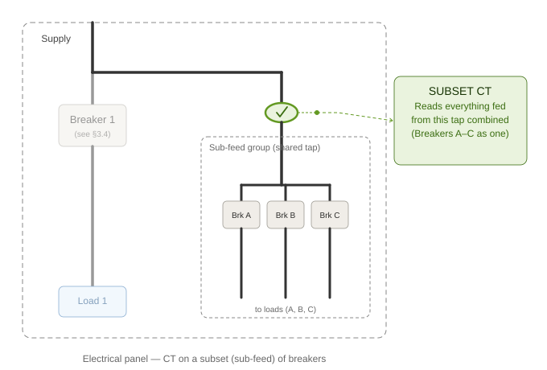
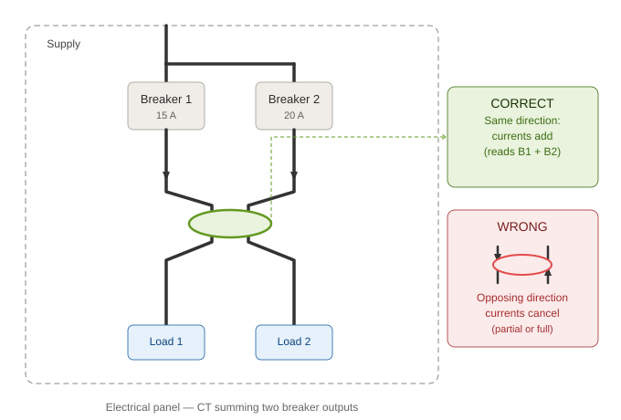

# Appendices

## Appendix A: Channel map

Fill in during installation (where known), take a photo before closing the panel.

| Channel # | Breaker label | Description (room/load) | CT rating | Role | Phase | Grouping |
| --- | --- | --- | --- | --- | --- | --- |
| 0 | Main breaker | Whole-home incoming line | 30 A | Grid | 1 | Group 0 |
| 1 | | | 30 A | Load | 1 | Group 1 |
| 2 | | | 30 A | Load | 1 | Group 2 |
| 3 | | | 30 A | Load | 1 | Group 3 |
| 4 | | | | | | |
| ... | | | | | | |
| 15 | | | | | | |

---

## Appendix B: Multi-phase configurations

*EnergyMe Home* is fundamentally a single-phase device, but it can monitor a **three-phase main supply**, **specific three-phase loads**, and **North American 120/240 V split-phase circuits** by setting the `Phase` field on each channel and combining readings on the dashboard via the `Grouping` field.

### B.1 Three-phase main supply

#### Hardware

1. Take **3 CTs** from the kit (or expansion kit).
2. Clamp each CT around **one of the three phase conductors** (L1, L2, L3), never around the neutral.
3. Plug them into the device:
   - **The same phase that powers the device** (the panel conductor the device's own brown L wire is connected to, [§3.2](01-installation.md#32-connect-the-power-supply-l-and-n)) → Channel `0`. Call this "L1" for labelling purposes; it does not need to be your panel's actual L1 busbar, just whichever phase the device itself draws power from.
   - The second phase → any free branch channel (e.g., Channel `1`), labelled "L2"
   - The third phase → any free branch channel (e.g., Channel `2`), labelled "L3"
4. **Write down which physical phase is on which channel;** you'll need it for the software step.

> **✅ TIP: Identifying which conductor is which phase**  
> If the panel isn't labelled, a multimeter tells you in seconds: measure the voltage **between two candidate phase conductors**. The same phase reads close to 0 V; two different phases read the full phase-to-phase voltage (roughly 400 V on a 230 V three-phase system; the exact figure depends on your grid). Repeat across all conductors you're considering to map out which is which before you start clamping.

> **⚠ Channel 0 is not just "any" phase.** The device has a single voltage input, wired to its own L/N power terminal. Every channel's power is computed against that one voltage reading, so Channel 0's CT **must** be on the same conductor that feeds the device, not an arbitrary phase. Getting this wrong produces plausible-looking but incorrect power and power factor readings on every channel, since the reference voltage and the measured current would be ~120° out of phase with each other. See the warning in [§3.3](01-installation.md#33-install-the-ct-on-channel-0-main-line).

#### Software

In **Channels** ([§4.5](02-setup.md#45-configure-each-channel)), set up the three channels like this:

| Channel | Label | Phase | Active | Grouping | Role |
| --- | --- | --- | --- | --- | --- |
| 0 | `Grid L1` | `1` | ☑ | `Grid` | `Grid (+ import, - export)` |
| 1 (or chosen branch) | `Grid L2` | `2` | ☑ | `Grid` | `Grid (+ import, - export)` |
| 2 (or chosen branch) | `Grid L3` | `3` | ☑ | `Grid` | `Grid (+ import, - export)` |

The three channels share the same **Grouping** value (`Grid`), so the dashboard will show a single "Grid" card with the **total three-phase power** of the main supply.

> **ⓘ Override the default group.** The Grouping field is pre-filled with `Group 0`, `Group 1`, `Group 2`, etc., by default. For three-phase grouping you must **replace** the default value with the shared group name (e.g., `Grid`) on each of the three channels.

> **✅ TIP: Use power factor to catch a wrong phase assignment**  
> A channel with the wrong `Phase` setting still shows plausible-looking numbers, just wrong ones, so it's easy to miss. The fast check: put a purely resistive load on the circuit (a kettle, a resistive heater) and look at its power factor. A resistive load should read **close to 100% PF**. If it instead reads **close to 50% PF**, that channel is very likely on the wrong phase (each phase is 120° apart, and being 120° off collapses a 100% PF load to almost exactly 50%). Try the other phase settings and watch the power factor climb back towards 100%.

### B.2 Three-phase branch load (e.g., EV charger, heat pump, oven)

#### Hardware

1. Take **3 CTs**.
2. Clamp each CT on one phase of the load.
3. Plug them into 3 free branch channels (e.g., Channels `3`, `4`, `5`).
4. Note down which phase is on which channel.

#### Software

Example for a three-phase EV charger:

| Channel | Label | Phase | Active | Grouping | Role |
| --- | --- | --- | --- | --- | --- |
| 3 | `EV charger L1` | `1` | ☑ | `EV charger` | `Load` |
| 4 | `EV charger L2` | `2` | ☑ | `EV charger` | `Load` |
| 5 | `EV charger L3` | `3` | ☑ | `EV charger` | `Load` |

The dashboard will show a single "EV charger" card with the total three-phase power of the appliance.

> **✅ TIP: Naming the group**  
> Use a clean group name (e.g., `Oven`, `Heat pump`, `EV charger`) without phase suffixes; that's what will appear on the dashboard. Put the phase suffix only in the `Label` of each channel, so you can still inspect individual phases if needed.

### B.3 North American 120/240 V split-phase

Standard residential service in North America is a **split-phase** system: a centre-tapped transformer provides two 120 V "legs" (L1 and L2) plus a neutral. Most circuits run line-to-neutral at 120 V (lighting, outlets); large appliances (electric range, water heater, dryer, central AC, Level 2 EV charger) run line-to-line at 240 V across both legs.

*EnergyMe Home* measures the voltage **line-to-neutral** (≈120 V), so a CT on a 240 V circuit would by default underestimate the power by a factor of two. The firmware handles this for you: select **`240V (Split Phase)`** in the `Phase` field of the channel and a **×2 voltage multiplier** is applied automatically.

> **⚠ WARNING: The device's own L and N power supply must always be wired line-to-neutral (≈120 V).**  
>
> The `240V (Split Phase)` setting in the `Phase` field **only changes how the current measurement of that one channel's CT is interpreted**. It does **not** change how the device itself is powered or how voltage is measured internally.
>
> - The device's **brown (L)** and **blue (N)** wires must always connect between **one 120 V leg and Neutral**, exactly as for a 120 V circuit.
> - Never wire the device's L and N across the two legs at 240 V. The internal power supply is rated 100-240 V AC and would not be damaged, but the **voltage reference used to compute power on every channel** would no longer match the firmware's assumption and **all measurements would be wrong**.
> - This applies regardless of how many channels are set to `240V (Split Phase)`: the device's power supply wiring is independent of the per-channel `Phase` setting.

#### When to use each phase setting (North America)

| Circuit type | What the CT is clamped on | Phase setting |
| --- | --- | --- |
| 120 V branch (one leg, line-to-neutral) | Either leg of the 120 V circuit | `1` |
| 240 V branch (line-to-line, both legs) | Either leg of the 240 V circuit | `240V (Split Phase)` |
| Main supply, single leg | One of the two main legs | `1` |
| Main supply, both legs separately | One CT on each leg, on separate channels | `1` on each |

#### Hardware

For a 240 V branch (e.g., a dryer or Level 2 EV charger):

1. Take **one** CT clamp.
2. Clamp it around **either** of the two line conductors of the 240 V circuit (L1 or L2). Do not clamp around the neutral, and never around both legs together.
3. Close the clamp until it clicks.
4. Plug the 3.5 mm jack into a free channel on the device.

#### Software

In **Channels** ([§4.5](02-setup.md#45-configure-each-channel)), set:

| Field | Value |
| --- | --- |
| Label | e.g., `Dryer` or `EV charger` |
| Phase | **`240V (Split Phase)`** |
| Active | ☑ |
| Grouping | One group per appliance (default `Group N` is fine) |
| Role | `Load` (or `Battery` / `Inverter` if applicable) |

> **ⓘ NOTE: Why ×2 and not measure the voltage directly?**  
> The voltage transformer inside *EnergyMe Home* is wired between Line and Neutral, which on a North American split-phase service is ≈120 V. A 240 V line-to-line circuit has exactly twice that RMS voltage, so multiplying current by 2× the measured 120 V gives the correct power. This is preferable to running an additional voltage reference and works for any standard split-phase service.

> **⚠ Do not use `240V (Split Phase)` outside North American split-phase systems.** It is a numerical shortcut for the specific 120/240 V split-phase topology and would produce wrong readings on a European 230 V single-phase or any three-phase system.

> **⚠ WARNING: A single CT with `240V (Split Phase)` only sees that one leg's current, doubled**  
> This setting assumes the whole breaker's load runs line-to-line (240 V, both legs equally). If the same breaker also feeds 120 V line-to-neutral loads on the leg you didn't clamp, such as a sub-panel with a mix of 240 V and 120 V circuits, or an appliance (e.g. an HVAC unit) with a 240 V compressor and a 120 V control board, those loads are on the other leg and this CT never sees them. If you know or suspect a breaker feeds mixed 240 V/120 V loads, don't use a single clamp with `240V (Split Phase)`; instead put a separate CT on **each** leg, set both to Phase `1`, and put them in the same Grouping. Since both legs are referenced to the same Neutral, their sum is the true total for that breaker regardless of how the individual loads inside it are split between legs. This is the same pattern already used for the whole-home main in the table above ("Main supply, both legs separately"), just applied to one branch instead of the panel's main feed.

### B.4 Advanced CT placement: subsets and summed breakers

A CT clamp reads whatever current flows through the conductor(s) inside its jaw at that point in the wiring; it has no notion of "one breaker." Beyond the standard one-CT-per-breaker installation, two placement patterns let you cover more circuits than you have free channels for.

> **ⓘ NOTE: Already covered elsewhere, not repeated here**
>
> - Grid CT on the main line: [§3.3](01-installation.md#33-install-the-ct-on-channel-0-main-line).
> - CT on a single breaker: [§3.4](01-installation.md#34-install-the-cts-on-the-branch-channels-1-to-15-critical-step-).
> - CT reading zero (L+N clamped together): [§3.3 step 4](01-installation.md#33-install-the-ct-on-channel-0-main-line) and the mistakes table in [§3.4.3](01-installation.md#343-step-by-step-for-each-branch-ct).

#### CT on a subset of the panel (sub-feed / shared tap)

If a group of breakers is fed from a common upstream tap, a wire that branches off the main bus into a local comb or sub-bus before reaching those breakers individually, a single CT clamped on that shared tap wire reads the sum of everything fed from it. This is the same physical situation described as a mistake in [§3.4.1](01-installation.md#341-the-shared-input-wire-problem) ("the wire on the input side carries the sum of the breakers downstream of it"), except here it's intentional: the tap is deliberately chosen upstream of a *specific* group of breakers, not upstream of the whole panel.

Use this when you have more breakers than free channels: group low-priority or related breakers (a sub-panel feed, a lighting comb, a group of outlets) behind one CT, and keep individual channels for the circuits you actually want to see separately.

> **⚠ WARNING**  
> Once combined at the tap, the device cannot separate the individual breakers again. Everything downstream of the CT is measured, named, and displayed as a single channel.

#### CT measuring the sum of two or more breakers

Instead of one CT per breaker, you can bundle two (or more) breaker **output** wires together and clamp a single CT around the bundle. The clamp reads the vector sum of the currents through it, regardless of how many separate conductors are inside its jaw.

> **⚠ WARNING: Three conditions must hold**
>
> - **Physical fit:** all bundled conductors must fit through the clamp's jaw opening together. The standard 30 A clamp has a small jaw; check it against your wire gauge and count before planning this. It may not be physically possible for thicker cables or more than two or three wires.
> - **Same direction:** every bundled conductor must run through the clamp with the same current-direction convention (all "load-bound" the same way). If one runs the opposite way, its current partially or fully cancels the rest instead of adding, the same physics as clamping L and N together (see [§3.3 step 4](01-installation.md#33-install-the-ct-on-channel-0-main-line)), just with more than two conductors.
> - **Same phase:** only sum breakers on the same phase/leg. In a three-phase panel, bundling breakers from different legs at the clamp does not give a meaningful reading; see [B.1](#b1-three-phase-main-supply) and [B.2](#b2-three-phase-branch-load-eg-ev-charger-heat-pump-oven) for how phases are meant to be combined instead.

> **ⓘ NOTE: This is different from the software Grouping field**  
> [Grouping](02-setup.md#45-configure-each-channel) combines **already-separate channels** on the dashboard: each CT still measures its own breaker independently, and the device adds the numbers together in software after the fact. Summing at the clamp is a **hardware-level sum**: the CT itself only ever sees one merged current, before the device measures anything. There is no internal-calculation bug either way, Modbus, the API, and the dashboard all report a correct total for that channel. What you lose by summing at the clamp is the ability to see the bundled breakers individually: the device never measured them separately, so it cannot un-sum them afterwards.

---

## Appendix C: LED status reference

The LED on the front of the device communicates the system state at a glance.

> **ⓘ Boot colours**  
> During the first ~10 seconds after power-on the LED cycles through yellow, orange, purple, and other colours briefly. **This is normal.** Each colour marks an internal startup stage. Wait for the LED to settle before drawing any conclusion.

### Normal operation

| LED | State | Meaning |
| --- | --- | --- |
| 🟢 Green, solid | Connected | Wi-Fi connected, monitoring normally |
| 🔵 Blue, slow pulse | Connecting | Wi-Fi credentials configured but not currently connected (first boot, router still booting, or temporary connection loss). Reconnects automatically; usually resolves within 60 s |
| 🔵 Blue, fast blink | Setup network active | No working Wi-Fi connection; the device's own setup network is open ([§4.1](02-setup.md#41-connect-to-the-devices-wi-fi-setup-network)). Also shown by an already-configured device that lost its network; its setup pages then require your admin login instead of being open to anyone |

> **ⓘ NOTE: Seeing something not listed here?**  
> The LED colour and pattern can also be set directly through the API (custom colours, and a "disco" pattern for fun), documented on the **Integrations** page in the web interface. If the LED is doing something unexpected, check there before assuming a fault; someone (maybe you, maybe an automation) may have set a custom pattern.

### Alerts

| LED | State | Meaning | What to do |
| --- | --- | --- | --- |
| 🟣 Purple, solid | Safe mode | Crash protection triggered; device is still monitoring and fully reachable via the web interface | Go to **Logs** in the top menu to investigate; the device will recover automatically |
| 🔴 Red, fast blink | Critical error | Persistent failure after recovery attempts | Restart via button ([Appendix D](#appendix-d-user-button-reference)); if it recurs, contact support |

### Button feedback (while the button is held; see [Appendix D](#appendix-d-user-button-reference))

| LED colour while holding | Action that will trigger on release |
| --- | --- |
| ⚪ White | Press registered but below action threshold. Release for no action |
| 🔵 Cyan | Restart |
| 🟡 Yellow | Password reset to default |
| 🟠 Orange | Wi-Fi reset (re-opens the device's own setup network) |
| 🔴 Red | Factory reset: all data and settings will be erased |
| ⚪ White (again) | Held too long. Release and try again |

---

## Appendix D: User button reference

The button on the front of the device lets you recover from common situations without needing a phone or laptop.

**How it works:** press and hold. The LED changes colour as you hold longer, showing which action will trigger on release. **Release the button as soon as you see the colour for the action you want.**

| Hold time | LED colour | Action on release |
| --- | --- | --- |
| < 2 s | White | No action |
| 2-5 s | **Cyan** | **Restart:** equivalent to a power cycle |
| 5-10 s | **Yellow** | **Password reset:** resets the web password to `energyme` |
| 10-15 s | **Orange** | **Wi-Fi reset:** clears Wi-Fi credentials and reopens the device's own setup network ([§4.1](02-setup.md#41-connect-to-the-devices-wi-fi-setup-network)). Energy data and channel configuration are preserved |
| 15-20 s | **Red** | **Factory reset** ⚠: erases all data, configuration, and credentials. Use only as a last resort |
| > 20 s | White | No action. Release and try again |

> **⚠ WARNING: Factory reset is irreversible**  
> A factory reset erases all accumulated energy data, channel names, calibration, Wi-Fi credentials, and your custom password. There is no undo. Only hold to red if you are certain.

> **✅ TIP: Colour as confirmation**  
> You don't need to count seconds. Watch the LED: release the moment it shows the colour you want. If you overshoot to white again, keep holding; just release without triggering any action. Then try again from the start.

---

**Previous:** [← Troubleshooting](03-troubleshooting.md)
