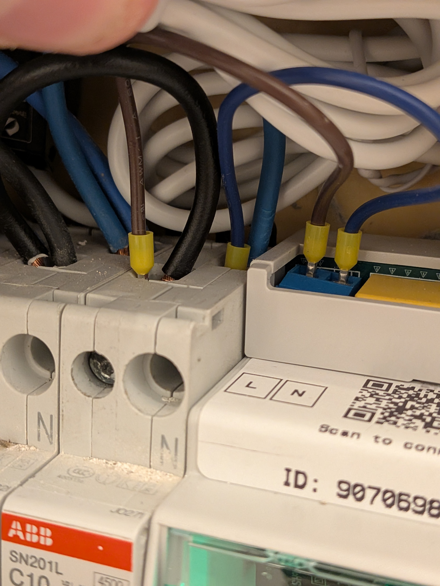
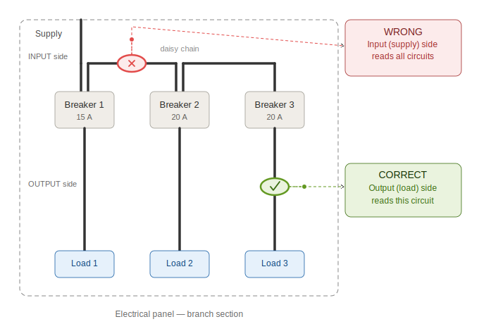

# Installazione

> Leggere il [preambolo di sicurezza](README.md#before-you-start-read-this-page) prima di iniziare.

---

## 1. Contenuto della scatola {#1-whats-in-the-box}

### 1.1 Kit Starter (sempre incluso) {#11-starter-kit-always-included}

| # | Articolo | Q.tà | Note |
| --- | --- | --- | --- |
| 1 | Dispositivo *EnergyMe Home* | 1 | Preassemblato, montaggio su guida DIN a 3 moduli, con i cavi L/N già collegati. **I canali sono numerati da 0 a 15 sulle etichette frontali** (16 canali in totale, 4 in alto e 12 in basso) |
| 2 | Pinze amperometriche (TA 30 A, cavo 1 m, jack 3,5 mm) | 4 | Tutte identiche; il valore "30 A" è stampato sul corpo di ogni pinza. 1 sarà utilizzata per il **Canale 0** (linea principale) e 3 per i circuiti derivati |

Troverà anche un **adesivo "Let's get started" con un codice QR** posizionato all'interno del coperchio della scatola.

> *E se sta leggendo queste istruzioni: ottimo lavoro, ha già trovato il codice QR. 🎯*

### 1.2 Kit di espansione (opzionale, se ordinato) {#12-expansion-kit-optional-if-ordered}

Se ha ordinato TA aggiuntivi per monitorare più di 3 circuiti derivati, li troverà in un sacchetto separato all'interno della scatola. Il dispositivo supporta fino a **16 canali in totale** (Canale 0 per la linea principale e Canali da 1 a 15 per i circuiti derivati).

> **ⓘ NOTA: Sui TA**  
> I TA standard hanno una **portata di 30 A** (stampata su ogni pinza). Funzionano senza problemi per **impianti monofase fino a ~7 kW a 230 V, o ~3,5 kW a 120 V**.
>
> Prima di applicare un TA, verificare la corrente nominale stampata sull'interruttore che il TA monitorerà; non deve superare la portata del TA. Se ci sono circuiti che assorbono correnti più elevate (alimentatori, pompa di calore), o un'alimentazione trifase, potrebbero servire TA di portata superiore (75 A o 150 A). Ci contatti a `support@energyme.net` per ordinarli.

> **ⓘ NOTA: Frequenza di rete**  
> *EnergyMe Home* funziona su reti a **50 Hz** (Europa, Asia, Africa, Oceania) e a **60 Hz** (Nord America, parti del Sud America e Giappone) senza necessità di configurazione.

> **ⓘ NOTA: Se manca qualcosa o è danneggiato**  
> Non installare il dispositivo. Contattare l'assistenza a `support@energyme.net` con una foto del contenuto della scatola.

> **⚠ Carichi trifase: leggere prima di continuare**  
> Se l'alimentazione principale è **trifase**, o se ci sono **carichi trifase specifici** da monitorare (es. una stazione di ricarica EV trifase), il cablaggio è leggermente diverso. **Leggere l'[Appendice B](appendices.md#appendix-b-three-phase-configuration) prima di iniziare l'installazione.**

---

## 2. Cosa serve (non incluso) {#2-what-you-need-not-included}

**L'elettricista avrà bisogno di:**

- Cacciavite isolato
- **3 moduli DIN liberi e contigui** nel quadro elettrico

**Lei avrà bisogno di:**

- Uno smartphone, tablet o laptop con Wi-Fi (2,4 GHz)
- Il nome (SSID) e la password della Sua rete Wi-Fi domestica

---

## 3. Installazione elettrica {#3-electrical-installation}

> **Prima di aprire il quadro:**
>
> 1. Aprire il coperchio del quadro e identificare visivamente **3 moduli DIN liberi e contigui** per il dispositivo.
> 2. **Spegnere l'interruttore generale.**
>
> Da questo punto in poi, il lavoro è realmente semplice; la maggior parte degli installatori lo completa in **10-15 minuti**.

> **⚠ ATTENZIONE: Da questa sezione in poi, il lavoro deve essere eseguito da un elettricista qualificato.**  
> Verificare l'assenza di tensione con un tester su ogni conduttore che si andrà a toccare.

### 3.1 Montaggio del dispositivo sulla guida DIN {#31-mount-the-device-on-the-din-rail}

1. Nello spazio di 3 moduli identificato, agganciare prima la **parte superiore** del dispositivo sulla guida.
2. Spingere la **parte inferiore** finché la clip a molla non scatta.
3. Tirare delicatamente verso il basso per verificare che il dispositivo sia bloccato in posizione.

### 3.2 Collegamento dell'alimentazione (L e N) {#32-connect-the-power-supply-l-and-n}

Il dispositivo è fornito con **due cavi già collegati** al morsetto di alimentazione interno: un **cavo marrone (Fase)** e un **cavo blu (Neutro)**. È sufficiente collegare le estremità libere di questi cavi ai **riferimenti di Fase e Neutro più vicini** nel quadro.

1. Collegare il **cavo marrone (Fase)** al riferimento di Fase disponibile più vicino, tipicamente il lato Fase di un qualsiasi interruttore del quadro.
2. Collegare il **cavo blu (Neutro)** alla **barra di Neutro** del quadro (il morsetto comune di neutro).
3. Serrare saldamente le viti.

> **ⓘ NOTA: Cablaggio personalizzato**  
> Se il cablaggio fornito non è adatto alla Sua applicazione, è possibile utilizzare cavi propri.
>
> Per farlo, sollevare la copertura plastica del morsetto di alimentazione sul dispositivo, svitare e scollegare i cavi marrone e blu, e collegare i propri cavi agli stessi morsetti, seguendo la stessa convenzione Fase/Neutro. Quindi riposizionare la copertura.
>
> Assicurarsi di utilizzare cavi di sezione e isolamento adeguati per la tensione di rete.

### 3.3 Installazione del TA sul Canale 0 (linea principale) {#33-install-the-ct-on-channel-0-main-line}

Il TA sul **Canale 0** è il canale più accurato e dovrebbe essere utilizzato per misurare l'energia totale che entra in casa.

1. Prendere **una** delle pinze amperometriche dal kit (una qualsiasi, sono tutte identiche).
2. Identificare il **conduttore della linea principale** a valle dell'interruttore generale (tipicamente il cavo marrone/nero che arriva dal contatore kWh nel quadro).
3. Aprire la pinza amperometrica.
4. Applicarla **attorno al solo conduttore di Fase oppure al solo conduttore di Neutro** - mai entrambi insieme. Applicarla attorno a L e N insieme fa annullare i campi magnetici e la lettura va a zero.
5. Chiudere la pinza fino a sentire/percepire lo scatto.
6. Inserire il jack da 3,5 mm nella presa contrassegnata con **`0`** sul dispositivo (i numeri dei canali sono stampati sull'etichetta frontale superiore).

> **ⓘ NOTA: La direzione della pinza non importa**  
> Le pinze amperometriche non sono direzionali. Se scoprirà in seguito (in [§4.7](02-setup.md#47-verification)) che le letture su un canale sono invertite (es. negative quando ne aspettava di positive), non sarà necessario riaprire il quadro. Basta spuntare la casella **Reverse** per quel canale nell'interfaccia web e il segno si invertirà istantaneamente.

> **⚠ Alimentazione principale trifase**  
> Se l'alimentazione principale è trifase, il TA sul Canale 0 va su **una delle tre fasi**, e saranno necessari TA aggiuntivi sulle altre due fasi (su canali derivati liberi). Vedere **[Appendice B](appendices.md#appendix-b-three-phase-configuration)**.

### 3.4 Installazione dei TA sui canali derivati (1-15): passaggio critico ⚠ {#34-install-the-cts-on-the-branch-channels-1-to-15-critical-step-}

Questo è il passaggio in cui avvengono la maggior parte degli errori di installazione. **Leggere questa sezione prima di applicare qualsiasi pinza.**

#### 3.4.1 Il problema del "cavo di ingresso condiviso" {#341-the-shared-input-wire-problem}

All'interno di un quadro elettrico, gli interruttori possono essere alimentati a **catena** sul lato **di ingresso**: la linea di alimentazione entra nell'interruttore #1, poi salta all'interruttore #2, poi al #3, e così via. Questo ha una conseguenza importante per la misura:

> **⚠ Il cavo sul lato di INGRESSO (alto) di un interruttore trasporta la corrente di QUELL'interruttore E di tutti gli interruttori a valle nella catena.**  
> Se si applica il TA sul cavo di ingresso, si leggerà la **somma di più circuiti**, il che è errato.

Il cavo sul **lato di USCITA (basso)** dell'interruttore trasporta **solo** la corrente dei carichi collegati a quello specifico interruttore. **È qui che deve andare il TA.**

#### 3.4.2 La regola {#342-the-rule}

> **Applicare sempre i TA derivati sul lato di USCITA (carico) dell'interruttore, ovvero sul cavo che esce dall'interruttore e va verso i carichi della casa. Mai sul bus di ingresso.**

#### 3.4.3 Procedura passo-passo per ogni TA derivato {#343-step-by-step-for-each-branch-ct}

Per ogni circuito che si vuole monitorare:

1. Decidere quale interruttore monitorare (es. "cucina", "luci", "lavatrice").
2. Localizzare il cavo di **uscita** di quell'interruttore, quello che esce dal morsetto inferiore verso i carichi. **Non** il cavo di ingresso in alto.
3. Aprire la pinza amperometrica.
4. Applicarla **attorno al solo conduttore di Fase o al solo conduttore di Neutro** di quel cavo di uscita - mai entrambi insieme, mai attorno al conduttore di protezione (cavo giallo/verde).
5. Chiudere la pinza fino allo scatto.
6. Inserire il jack da 3,5 mm in una presa libera sul dispositivo, **numerata da 1 a 15** (i numeri dei canali sono stampati sulle etichette frontali).
7. **Se si sa di quale circuito si tratta, annotare il numero del canale e l'etichetta dell'interruttore** (es. "Canale 2 → Luci giardino"). Lo si userà in [§4.5](02-setup.md#45-configure-each-channel) per dare a ciascun canale un nome significativo nell'interfaccia. Usare la tabella in [Appendice A](appendices.md#appendix-a-channel-map).

> **✅ SUGGERIMENTO: Non sa cosa controlla ogni interruttore?**  
> Nessun problema. Inserire i TA in qualsiasi canale libero e procedere con l'installazione. Una volta che il dispositivo sarà online, potrà rinominare i canali in qualsiasi momento dall'interfaccia web.

> **✅ SUGGERIMENTO: Non si preoccupi dell'orientamento del TA**  
> Ha installato un TA al contrario per errore? Nessun problema. EnergyMe rileva automaticamente i TA invertiti alla prima lettura dopo l'attivazione di un canale e ne inverte la polarità per Lei. Non c'è bisogno di riaprire il quadro o regolare manualmente nulla.

> **⚠ ATTENZIONE: Errori comuni da evitare**
>
> - ❌ Applicare il TA sul cavo di **ingresso** di un interruttore (legge più circuiti)
> - ❌ Applicare il TA sul **pettine di distribuzione** (legge la somma di tutti gli interruttori sul pettine)
> - ❌ Applicare il TA attorno a **entrambi** L e N (legge zero)
> - ❌ Applicare il TA attorno al **conduttore di protezione** (legge zero in condizioni normali, può leggere correnti di guasto in altre condizioni)
> - ❌ Forzare la pinza su un cavo troppo spesso; le ganasce devono chiudersi completamente e scattare

> **⚠ Carichi derivati trifase**  
> Se un carico specifico che si vuole monitorare è trifase (es. una stazione di ricarica EV trifase o una pompa di calore), vedere **[Appendice B](appendices.md#appendix-b-three-phase-configuration)** prima di applicare i TA.

### 3.5 Controllo finale prima di chiudere il quadro {#35-final-check-before-closing-the-panel}

Prima di riaccendere l'interruttore generale:

| Verifica | OK? |
| --- | --- |
| Tutti i jack dei TA sono completamente inseriti nel dispositivo (1 sul Canale 0, gli altri sui Canali 1-15) | ☐ |
| I cavi marrone (L) e blu (N) dal dispositivo sono saldamente collegati, nessun rame visibile | ☐ |
| Il TA del Canale 0 è sul conduttore di Fase principale | ☐ |
| Ogni TA derivato è sul lato di USCITA del suo interruttore (non sul pettine di distribuzione) | ☐ |
| Nessun utensile o vite lasciato all'interno del quadro | ☐ |
| Mappa dei canali ([Appendice A](appendices.md#appendix-a-channel-map)) compilata (dove noto) e fotografata | ☐ |
| Coperchio del quadro pronto per essere reinstallato | ☐ |

### 3.6 Prima accensione {#36-first-power-on}

1. Chiudere il coperchio del quadro.
2. Accendere l'interruttore generale.
3. Osservare il LED sul fronte del dispositivo.

> **ⓘ NOTA: Colori della sequenza di avvio**  
> Durante i primi ~10 secondi il LED attraversa diversi colori in rapida successione (giallo, arancione, viola, e altri). **Questo è del tutto normale;** ogni colore segna una fase della sequenza di avvio. Non intervenire su nessuno di essi; attendere che il LED si stabilizzi.

Dopo l'avvio, sono possibili tre esiti:

| Comportamento del LED | Significato | Prossimo passo |
| --- | --- | --- |
| 🔵 Blu, lampeggio veloce | Wi-Fi non ancora configurato; portale captive attivo | Andare al **[§4.1](02-setup.md#41-connect-to-the-devices-wi-fi-captive-portal)** |
| 🔵 Blu, pulsazione lenta | Wi-Fi noto trovato ma non ancora connesso (es. router ancora in avvio) | Attendere fino a 60 s; il LED dovrebbe stabilizzarsi su verde fisso |
| 🟢 Verde fisso | Connesso al Wi-Fi domestico, monitoraggio in corso | Andare al **[§4.3](02-setup.md#43-access-the-web-interface)** (saltare [§4.1](02-setup.md#41-connect-to-the-devices-wi-fi-captive-portal) e [§4.2](02-setup.md#42-configure-your-home-wi-fi)) |

> **⚠ ATTENZIONE**  
> Se si sente odore di bruciato, ronzio o si vede fumo: **spegnere immediatamente l'interruttore generale** e contattare l'assistenza prima di fare qualsiasi altra cosa.

---

**Successivo:** [Configurazione →](02-setup.md)
